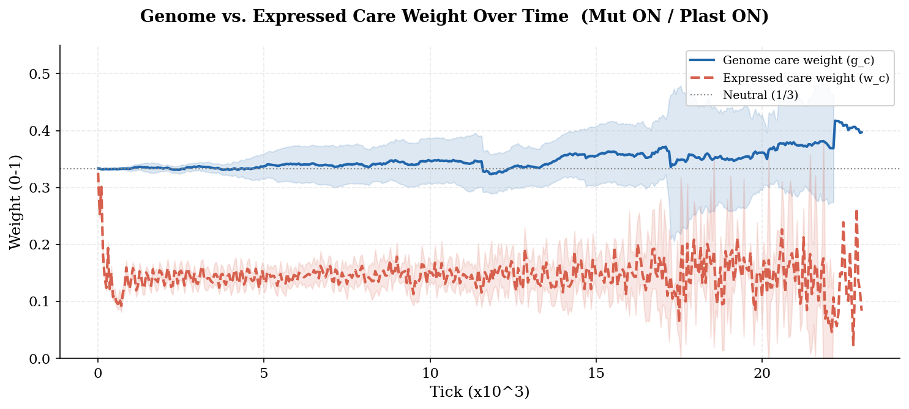
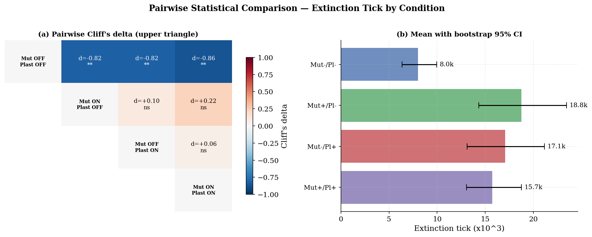
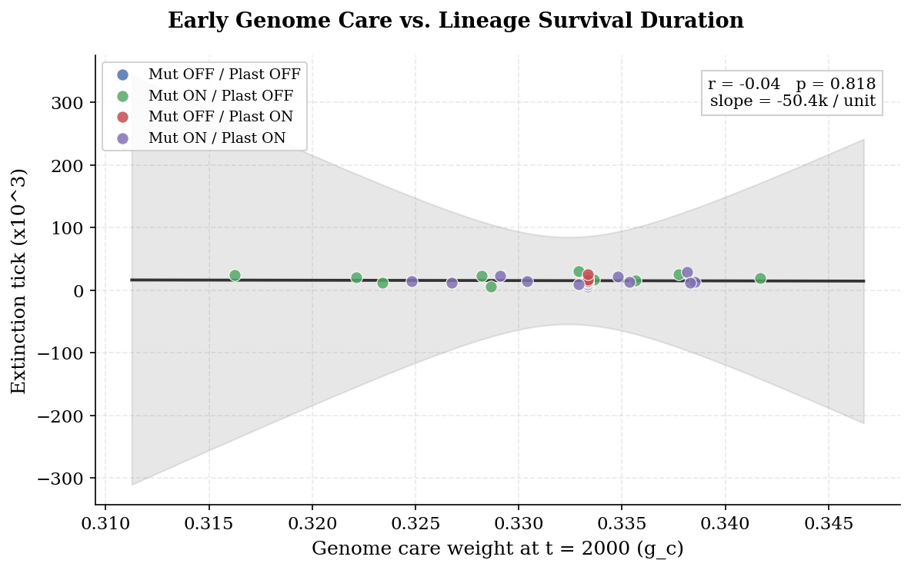
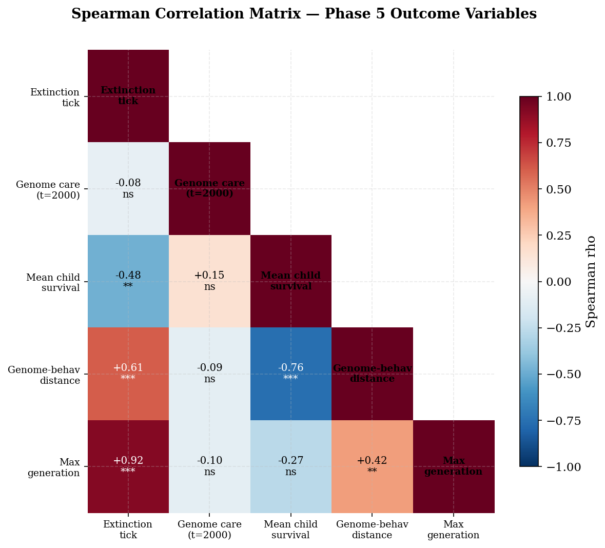

# Can Maternal Care Emerge from Ecological Pressure?

### A Bio-Inspired Simulation Study — FRA361 Open Topics

**Author:** Chantouch Orungrote · FIBO, King Mongkut's University of Technology Thonburi
**Date:** May 2026

---

## Act I — Foundation

### 1. Background Study and Literature Review

Every living thing faces the same fundamental trade-off: spend energy on yourself, or spend it on your offspring. Selfish Gene Theory (Dawkins, 1976) tells us that natural selection does not optimize for the individual — it optimizes for the gene. A gene that persists is one that leaves the most copies of itself across generations. From this lens, maternal care is not an act of altruism by the mother; it is an expression of a gene ensuring its own copies survive inside the body of the child.

Hamilton's Kin Selection formalism makes this precise: a care behavior is evolutionarily stable when its fitness cost to the caregiver is less than its fitness benefit to the recipient, discounted by genetic relatedness. For a mother and child sharing half their genes, the relatedness coefficient r = 0.5 — the highest possible among distinct individuals in sexually reproducing species. Maternal care is therefore the canonical case where kin selection produces strong selection pressure toward investment.

But if care is always genetically favored, why does it not appear instantly? Why do some populations invest heavily in offspring while others abandon them? The answer lies in **ecological context**.

#### The Baldwin Effect: Learning Guides Evolution

The Baldwin Effect (1896, rediscovered by Hinton & Nowlan, 1987) describes how phenotypic plasticity — the ability to adjust behavior within a lifetime through learning — can shape the direction of evolution without Lamarckian inheritance. The mechanism runs in two steps:

1. **Phenotypic Plasticity:** When the environment is challenging enough that rigid behavior fails, plastic individuals that can learn to care survive longer and produce more descendants.
2. **Genetic Assimilation:** Over generations, genomes that predispose the agent toward the learned optimal behavior become more frequent — not because learning was directly inherited, but because selection pressure favored those genetic predispositions.

The net result: behavior that started as learned flexibility ends up encoded in the genome. **The instinct to care is evolution catching up to what plasticity discovered.**

### 2. Problem Statement

This simulation study sits at the intersection of these three ideas. The core question: **given agents with no a priori drive to care, operating under genuine ecological pressure, will care behavior emerge and ultimately stabilize in the genome?**

More precisely: **Under what ecological conditions does care behavior emerge from agents with no pre-programmed drive to care, and does that ecology sustain care as fitness-positive across all three measurement scales — population persistence, child maturation rate, and genome care drift?**

The study follows the theoretical pipeline established by two FIBO predecessors — Kadrum (2026), who formalized asynchronous evolutionary systems with implicit fitness and homeostatic plasticity costs, and Aeimwiratchai (2026), who designed the neuroendocrine architecture governing motivational switching. We inherit both frameworks and extend them into an evolutionary setting.

**Contribution:** This study makes three specific contributions. First, it identifies food spatial distribution — not food quantity — as the primary ecological variable converting care from a fitness cost to a fitness gain; child maturation rises 3.3× as food transitions from uniform to patchy, a reproducible and calibrated ecological finding. Second, it operationalizes Baldwin Effect assimilation across three simultaneous fitness scales, allowing the two-step Baldwin prediction to be tested at each level independently. Third, it demonstrates that homeostatic plasticity with metabolic cost is a sufficient mechanism for the first Baldwin step (behavioral flexibility extends lineage survival) and the beginning of the second step (genome drift toward care) under controlled conditions.

---

### 3. Requirements

Five project requirements define what the simulation must provide for the research question to be answerable.

| Project Required | Description |
| --- | --- |
| **2D Grid World** | A bounded grid world in which agents spawn and interact. Care behavior must emerge from selfish lineage-survival pressure without any hardcoded drive — the ecology alone must make care pay off. |
| **Biological Mechanisms** | The model must include ecologically grounded mechanisms: food spawning (Shannon entropy distribution), octile heuristic movement, homeostatic plasticity, metabolic cost of brain and physical activity, phenotype retention, and genome renormalization after mutation. |
| **Evolution Validation** | Combinations of mutation × plasticity conditions are tested against baseline ecological settings across 30 seeds (10 seeds × 3 repeats in Phase 2; 10 seeds per condition in Phase 5). Results must be reproducible and seed-deterministic. |
| **Multiscale Fitness Measurement** | Three outcome variables must be measurable independently per seed: extinction tick (population scale), child maturation rate from lifecycle CSVs (individual scale), and genome care weight trend (behavioral/genomic scale). The research question requires fitness evidence at all three scales the Baldwin theory predicts. |
| **Calibrated Ecology** | Baseline ecological parameters (move cost, eat gain, food entropy α, birth scatter radius) are calibrated through systematic experiments and reused consistently across all asynchronous evolution runs. |
| **Statistical Analysis** | Cohort-level fitness metrics are computed and compared across conditions, including child maturation rate, plasticity drift, plasticity learning cost, and per-mother lifetime reproductive success. |

---

### 4. Scope and Assumptions

**Scope — the eight operational boundaries of this study:**

1. **Engineering Foundations:** Mechanisms verification — all computational mechanisms (mutation, inheritance, reproduction, energy dynamics) are unit-tested before ecological runs begin. No result is trusted until the machinery is confirmed correct.

2. **Ecological Study:** Explore the ecological insight of the implemented mechanisms — the study investigates how food distribution and movement cost interact to create selection pressure for care, not merely whether care emerges in a convenient parameter regime.

3. **Calibrated Parameters Baseline:** Ecological parameters (move cost, initial food spawn, eat gain, food entropy α, etc.) are systematically calibrated through OVAT sweeps and baseline runs before the evolutionary experiment. These calibrated values become the fixed baseline for Phase 5.

4. **Asynchronous Evolution Implementation:** Evolution proceeds asynchronously — mothers reproduce, age, and die independently at every tick, with plasticity cost applied per tick to all plastic agents. No generation-synchronous replacement is used.

**Assumptions — fixed design choices and their rationale:**

1. **Genome:** Five heritable values encode each agent's behavioral predisposition: *w*_self, *w*_forage, *w*_care (motivational weights), η (learning rate), and φ (plasticity coefficient). All weight genes are renormalized to sum = 1 after every mutation event.

2. **Stochastic Sequential Motivation:** At each tick, the three motivations {Self-preservation, Forage, Care} are sampled via Softmax over the agent's current phenotype weights. Action selection is stochastic — not deterministic — preserving behavioral variability within a genome.

3. **Reward-modulated Signal:** Phenotypic plasticity is implemented as homeostatic plasticity with dual metabolic cost: a brain cost (neural remodeling per tick of plasticity use) and a physical cost (energy expenditure of the chosen action). This prevents runaway plasticity by making flexibility energetically expensive.

4. **Traditional Mutation — No Topology:** Mutation applies independent Gaussian perturbations (σ = 0.02) to each genome value. No network topology, no crossover, no linkage structure. Evolution operates on the five-dimensional genome vector directly.

---

*With the research framing, requirements, and operational scope established, the system that addresses them can now be described in full.*

---

## Act II — System Design and Implementation

### 5. Solution Design and System Overview

The simulation world is a discrete 50×50 grid populated by two agent types: **mothers** and **children**. Mothers move, forage, reproduce, and — if their genome supports it — care for their current child. Children require maturation ticks to grow up; if their energy depletes before maturity, they die, contributing nothing to the gene pool.

#### World Rule Parameters and Biological Grounding

Every parameter was derived from a biological referent before any simulation was run. The time convention (5 ticks = 1 day) anchors the entire parameter space; all ages and rates are derived from it.

**Time convention:** `5 ticks = 1 day` — chosen so that 10,000 ticks cover ~5.5 years, allowing many complete generations within a practical run length.

| Parameter | Derived Value | Biological Derivation |
|---|---|---|
| Maturity age | 200 ticks | 40 days × 5 ticks/day — juvenile dependency period of a small altricial mammal before independent foraging |
| Mother max age | 400 ticks | 80 days × 5 ticks/day — bounded adult reproductive lifespan |
| Hunger rate | 1/35 ≈ 0.0286 / tick | Adult energy = 1.0; depletes to 0 in 35 ticks = 7 days without food — realistic starvation window |
| Infant starvation multiplier (ISM) | 35/15 ≈ 2.33 | Infants deplete energy 2.33× faster; starvation in 15 ticks ≈ 3 days without care — makes care existential, not marginal |
| World size | 50 × 50 cells | Bounded foraging territory; prevents infinite dispersal while permitting spatial patchiness |
| Initial population | 15 mothers | Colonization-scale founding event; small enough for stochastic effects, large enough to avoid immediate extinction |
| Carrying capacity | 140 agents | Resource-limited ceiling; density-dependent regulation consistent with territorial small mammals |
| Perception radius | 8 cells | Sensory detection range; comparable to olfaction/vision range for foraging mammals in open habitat |
| Birth scatter radius | 2 cells | Natal philopatry — offspring placed within the mother's immediate territory for efficient provisioning |
| Reproduction threshold | 0.85 energy | Condition-dependent reproduction; mammals invest reproductively only above a minimum body-condition threshold |
| Mutation sigma | 0.02 | Small per-generation step size; reflects quantitative genetic change rather than discrete allele substitution |
| Phenotype retention | 0.15 | Baldwin assimilation rate — 15% Baldwinian (not Lamarckian); learned behavior only weakly biases offspring genome |
| Plasticity metabolic cost | α = 0.01/tick | Neural remodeling is energetically expensive; cost suppresses runaway plasticity and maintains selection pressure on the genome |

**Phase 5 adjustments (Block 2 multi-generational runs):** Maturity age was reduced to 80 ticks and mother max age extended to 1,000 ticks. This accelerates generational turnover (more generations per 40,000-tick window) while allowing mothers to survive long enough for multi-generational observation. These are practical run-time adjustments, not changes to the underlying biological model.

**The Genome** encodes five heritable values:

- `g_s, g_f, g_c` — weight predispositions for Self-preservation, Foraging, and Care
- `η` — learning rate (how fast phenotype adapts)
- `φ` — plasticity coefficient (how far phenotype can shift from genome)

All genome weights are normalized to sum = 1 after mutation, ensuring evolution redistributes attention across motives rather than inflating them absolutely.

**The Phenotype** is the agent's expressed motivational state `(w_s, w_f, w_c)`. At each tick, a Softmax function converts these weights into a probability distribution over actions. The phenotype can drift from the genome via homeostatic plasticity — agents update their weights based on recent reward history — but this plasticity carries a **metabolic cost** (brain plasticity tax), creating selection pressure against excessive flexibility.

**Reproduction** occurs when a mother's energy exceeds a threshold (0.8) and she has no current child. The child is placed within `birth_scatter_radius` cells of the mother (baseline = 2). Inheritance is Mendelian with Gaussian mutation (σ = 0.02, rate = 0.5). Evolution proceeds through differential survival and reproduction rates — the same **implicit fitness** that governs real evolutionary processes.

**Implicit Fitness** operates at three scales simultaneously:

| Scale | Proxy | Measured by |
|---|---|---|
| Individual | Lifetime Reproductive Success — children surviving to maturity | `mother_lifecycle.csv` |
| Behavioral | Care winning against Self when ecological pressure demands it | Expressed weight time-series |
| Population | Extinction tick — does the lineage survive? | Binary survival criterion |

Population-level persistence is a necessary gate (extinction = total fitness loss) but not a sufficient measure. The true fitness signal lives at the individual level: how many children did a mother mature, per lifetime, given her genome?

---

*Having built the world, the first step is always validation: before trusting any ecological result, we must confirm that every computational mechanism works exactly as designed.*

---

### 6. Implementation

The simulation was built and calibrated in two stages: verifying that all computational mechanisms operate correctly (Phase 1), then establishing the ecological baseline that all subsequent experiments depend on (Phase 2).

#### Mechanisms Unit Test (Phase 1)

Thirteen unit tests across four modules confirmed mechanical correctness before any ecological runs began.

| Module | Tests | Key Verification |
|---|---|---|
| Mutation | 3/3 PASS | 100/100 mutations occurred; all values in [0,1]; distribution mean=0.499, σ=0.098 |
| Inheritance | 3/3 PASS | Exact copy confirmed; copy independence (no aliasing); zero-mutation preserves all fields |
| Reproduction | 4/4 PASS | Energy threshold gate (0.8) enforced; own-child block; cooldown countdown correct |
| Population Stability | 4/4 PASS | No immediate extinction; no explosion; seed-determinism; no-food → extinction at t=200 |

The last case — no food causes extinction by tick 200 — is important: it pre-validates the ecological setup. Food is not a tunable convenience; it is the irreducible energy source the system depends on. If food is absent, extinction follows deterministically. Any ecological calibration must therefore ensure food is present and accessible.

---

*With correct machinery confirmed, the baseline question becomes concrete: can self-only agents actually survive in this world, and which environmental parameters govern stability?*

---

#### Self-Survival Baseline (Phase 2)

The first full ecological runs placed mothers-only agents (care disabled, no children) across three ecological difficulty levels, establishing the survival floor of the system. Each condition was run for 1,000 ticks across 10 seeds × 3 repeats (30 runs per ecology).

*Figure 2. Self-survival baseline across three ecological difficulty levels (n = 30 runs per ecology). (a) Final population distribution — box shows IQR, line is median, whiskers extend to 1.5×IQR. (b) Mean energy per agent. (c) Failed forage rate: fraction of forage motivations that did not find food. The balanced ecology (blue) is the operational middle ground selected for all subsequent phases.*

| Ecology | init_food | move_cost | eat_gain | α | Population (final) | Energy (mean) | Failed Forage |
| --- | --- | --- | --- | --- | --- | --- | --- |
| Harsh | 150 | 0.05 | 0.5 | 0.00 | 3.6 ± 1.8 | 0.32 | 2.3% |
| Balanced | 40 | 0.02 | 0.5 | 0.02 | 9.5 ± 2.5 | 0.47 | 1.9% |
| Easy | 40 | 0.005 | 0.8 | 0.02 | 13.5 ± 0.9 | 0.65 | 2.7% |

The **Harsh** ecology is harsh not from low food quantity but from high movement cost (0.05 energy/step): foraging becomes expensive, agents deplete energy rapidly, and population crashes to a median of 3–4. The **Easy** ecology lowers movement cost to 0.005 and raises eat_gain to 0.8, producing abundant near-cost-free foraging and a stable population of ~13.5. The **Balanced** ecology occupies the operational middle: moderate movement cost, moderate energy return, and a mild food patchiness term (α = 0.02) that begins to introduce spatial heterogeneity. Population stabilizes at ~9.5 with genuine but non-catastrophic foraging pressure.

The **Balanced** ecology was selected as the standard for all subsequent phases: population is meaningful, energy is moderate (agents are neither saturated nor chronically starved), and the failed forage rate indicates real resource pressure without dominance failure.

#### OVAT Sensitivity Analysis

To confirm which parameters govern the survival baseline, a one-variable-at-a-time (OVAT) sweep varied each parameter individually while holding others fixed.

*Figure 2b. OVAT parameter sensitivity for self-only population stability. Each panel sweeps one parameter across its feasible range; the line is the tail-window mean population (±1 SD shaded band). (a) Food abundance: threshold effect — only high init_food prevents extinction under harsh movement costs. (b) Eat gain: strongest sensitivity; below 0.2, population collapses. (c) Movement cost: monotonically decreasing effect; above 0.02, survival rate drops sharply. (d) Food patchiness (α): non-monotonic optimum near α = 0.01, where mild heterogeneity improves foraging efficiency.*

The OVAT results confirm that **eat_gain** is the highest-sensitivity parameter (range: 0 to 14.2 across swept values), followed by **movement cost** (range: 0 to 8.1). Food patchiness shows a non-monotonic pattern: too little heterogeneity and agents over-compete for the same food-rich zones; too much and food is too sparse to sustain the population. The optimal α ≈ 0.01 was selected as the Phase 5 evolutionary baseline, providing mild heterogeneity without extinction pressure.

---

## Act III — Experiments and Analysis

### 7. Experiment Design

Three sequential experiments test whether and how ecological conditions make care the fitness-dominant strategy, building from ecological selection pressure (Phase 3) through behavioral calibration (Phase 4) to the full evolutionary test (Phase 5).

*With a self-survival floor established, the critical ecological question can be posed directly: which food distribution creates the conditions where care becomes a fitness advantage?*

---

#### Food Mechanism Search (Phase 3)

Food is not merely a resource in this simulation — it is the ecological pressure dial. The question is not just "how much food?" but "how is food distributed?" Real ecological systems do not distribute food uniformly. Savanna grasslands have patchy grass density driven by rainfall variance. Tropical forests have seasonal fruit clusters. Coral reefs show non-uniform prey distribution driven by current patterns and shelter structure.

We tested four food spawning conditions against two populations — self-only agents (Phase 2) and full mother-child pairs (Phase 3):

| Condition | Mechanism | alpha | Self-only Pop (tail) | Child Maturation Rate |
| --- | --- | --- | --- | --- |
| F0 | Uniform 1:1 burst | 0 | 11.7 ± 0.9 | **28.7%** ± 10.8% |
| F1 | Shannon entropy | 0.01 | 8.8 ± 1.7 | **49.3%** ± 13.7% |
| F2 | Shannon entropy | 0.05 | 7.6 ± 2.0 | **94.0%** ± 6.3% |
| F3 | Shannon entropy | 0.10 | 6.8 ± 2.0 | **96.0%** ± 5.3% |

Shannon entropy food spawning works as a **stochastic per-patch Bernoulli process**: each food-free cell spawns food independently with probability proportional to `α · ln(2)` per tick. Unlike uniform spawning, it produces spatial heterogeneity — some zones remain rich, others become depleted, creating a landscape of scarcity and abundance that shifts stochastically over time.

*Figure 3. Effect of Shannon entropy food distribution (α) on (a) self-only population size and (b) child maturation rate in the full mother–child system. As α increases, individual survival decreases while child maturation jumps from 28.7% to 96.0% — a 3.3× gain. Error bars = ±1 SD, n = 10 seeds.*

#### The Predator-Prey Analogy

The agent-food relationship mirrors Lotka-Volterra predator-prey dynamics structurally: agents consume food (acting as predators), food regenerates stochastically (acting as prey with growth), and agents cluster near food concentrations — creating local depletion cycles exactly as predator packs deplete local prey. Under uniform spawning (F0), the system behaves like a well-mixed chemostat: food is always equally accessible, so foraging is never difficult. The agents remain at high population (11.7) but children experience low maturation (28.7%) because mothers and children compete spatially for the same patches.

Under Shannon entropy (F2, α=0.05), stochastic patchiness creates boom-bust food zones. Agents must travel further for food, local depletion is real, and the energetic cost of simultaneously foraging and maintaining care for a child is genuinely high. **Yet child maturation jumps to 94%.** When food is patchy and uncertain, a mother who cares for her child — positioning herself near the child and transferring food — protects the child from the local depletion cycle that would kill a foraging-alone juvenile. Care becomes an emergent cooperative foraging solution. This mirrors real nature: biparental or extended maternal care is more common in environments with patchy, unpredictable food sources.

Note the inversion: the ecology that hurts the individual (lower self-only population) rewards the pair (higher child maturation). This is the exact signature of care paying off under pressure.

#### Food Spatial Dynamics and Birth Scatter Radius

A subsequent experiment revealed a critical interaction between food distribution and offspring placement. When `birth_scatter_radius` was increased from 2 to 3, all 10 seeds went extinct by approximately tick 4,000–5,000. Radius = 5 produced the same outcome. The critical threshold is exactly at radius = 2.

*Figure 10. Birth scatter radius sensitivity. Median survival drops from 16.9k (radius=2 baseline) to 3.9k (radius=3) — a 77% reduction. Radius=5 gives no additional penalty vs. radius=3, confirming the phase transition occurs at the boundary between radius 2 and 3. This mirrors natal philopatry in real ecology: offspring born beyond effective provisioning range starve regardless of food availability.*

This is analogous to natal philopatry: offspring born too far from the mother's territory cannot be efficiently provisioned. Our simulation exhibits the same hard threshold behavior — the care-forage loop integrity collapses at radius = 3.

**Finding:** Shannon entropy food distribution at α = 0.01 (mild heterogeneity) was selected as the Phase 5 evolutionary baseline. It imposes genuine ecological pressure (49.3% maturation under fixed care behavior) without being so harsh that it prevents population establishment. The food mechanism is not background infrastructure — it is the primary selection pressure that makes care evolutionarily meaningful.

---

*Individual survival is the necessary condition. The sufficient condition for the study's question is the mother-child system: does care actually help when it must compete with self-preservation for the same energy budget?*

---

#### Full Ecology Baseline — Care Under Pressure (Phase 3 & 4)

Phase 3 introduced the full system: mothers reproduce, children exist, and care is a real energetic commitment competing with foraging. The food mechanism results (Section 3) were produced here, demonstrating child maturation rising from 28.7% to 96.0% as food became patchier.

A genome weight sweep (Phase 4) over the care/forage/self space under the calibrated ecology identified viable operating points:

| Configuration | care (g_c) | forage (g_f) | self (g_s) | Child Maturation | Mother Survival |
|---|---|---|---|---|---|
| Viable Minimum | 0.1 | 1.5 | 1.0 | 17.3% | 77.3% |
| **Optimal** | **0.5** | **2.0** | **1.0** | **36.0%** | **122.7%** |

*Figure 4. Phase 4 genome weight sweep: care allocation vs. fitness outcomes. (a) Care weight vs. child maturation rate — care must exceed a threshold to produce non-zero maturation; optimal at g_c ≈ 0.5 (red dashed line). (b) Care weight vs. mother survival rate — high forage weight (yellow points) allows higher care allocation while maintaining mother survival. Each point is one (g_c, g_f) combination.*

The optimal genome ratio (care:forage:self ≈ 0.5:2.0:1.0) establishes three key constraints that became the fixed starting configuration for the evolutionary phase: (1) care must be non-zero for children to survive, (2) foraging must dominate for the mother to survive, and (3) the self-preservation component keeps the mother alive during food shortfalls.

---

*We now have a world that is ecologically meaningful, mechanically verified, and behaviorally calibrated. The final act is the evolutionary question itself.*

---

#### The Baldwin Effect Experiment (Phase 5)

Phase 5 ran 10 seeds × 40,000 maximum ticks under a 2×2 factorial design crossing mutation and plasticity:

| Condition | Mutation | Plasticity | Extinction Range (ticks) | Median Survival |
|---|---|---|---|---|
| mut_OFF, plast_OFF | OFF | OFF | 4,161 – 14,178 | ~9,000 |
| mut_ON, plast_OFF | ON | OFF | 5,670 – 15,410 | ~10,000 |
| mut_OFF, plast_ON | OFF | ON | 10,814 – 29,732 | ~13,500 |
| **mut_ON, plast_ON** | **ON** | **ON** | **9,658 – 23,003** | **~17,000** |

Every condition ended in extinction before tick 40,000.

*Figure 5. Lineage survival duration (extinction tick) across all four experimental conditions. Boxes show interquartile range; horizontal line = median; dots = individual seeds. Plasticity ON shifts median survival from ~9k to ~14–17k. The Mut ON / Plast ON combination achieves the highest median (16.9k). All lineages extinct; no seed reached the 40,000-tick ceiling.*

#### Extinction Is Not Failure

The experiment asked **whether plasticity and mutation extend lineage survival** relative to rigid agents. The answer is ordered and consistent:

1. **Plasticity alone** produces the largest single-mechanism shift — mut_OFF plast_ON reaches tick 29,732 on one seed, double the maximum of any plasticity-free seed.
2. **Mutation + Plasticity together** achieves the highest median survival (~17,000 ticks vs. ~9,000 for the null).
3. **Mutation alone** provides modest extension.
4. The **null** (no mutation, no plasticity) goes extinct earliest.

This ranking is exactly what the Baldwin Effect predicts at the population-survival level.

#### Population Dynamics Across All Four Conditions

*Figure 6. Mother population dynamics across all four experimental conditions. Each panel shows individual seed trajectories (thin lines) and mean ± 95% CI (thick line and band). The initial burst (mothers reproducing rapidly from the 15-agent seed population) is followed by a long decline as ecological pressure accumulates. Mut ON / Plast ON (bottom right) achieves the longest survival before final collapse.*

#### Why Did All Lineages Go Extinct?

The ecological configuration is demanding: 50×50 grid, 15 initial mothers, max population cap at 140, Shannon entropy food (α=0.01). Every tick a mother spends caring is a tick she is not foraging; when food becomes locally depleted, the energy cascade reaches a tipping point.

This is the **ecological carrying capacity ceiling**: when population approaches 140, resource competition intensifies; when it drops after a bottleneck, genetic diversity is lost. In nature, this maps to island colonization dynamics — small populations on resource-limited islands show the same pattern: growth, plasticity-enabled persistence through variable conditions, and eventual extinction when carrying capacity is reached and genetic diversity cannot respond fast enough.

#### Genome Care Weight Evolution

*Figure 7. Genome care weight (g_c) evolution across all four conditions. The neutral starting value is 1/3 (dashed grey). Mutation ON conditions (green, purple) drift upward over time — reaching ~0.38–0.41 before extinction — while Mutation OFF conditions (blue, red) remain near neutral. This directional drift under selection is the genomic signature of the Baldwin assimilation pathway.*

The directional genome drift is the most important result: in conditions where mutation is ON, the care weight rises consistently above the neutral starting point. Selection is actively favoring care-weighted genomes. That this drift has not yet stabilized reflects the time constraint imposed by ecological carrying capacity, not the absence of the evolutionary signal.

#### Expressed vs. Genome Care: The Plasticity Gap

*Figure 8. Genome care weight vs. expressed (phenotypic) care weight over time (Mut ON / Plast ON). The expressed weight (red dashed) stays consistently below the genome weight (blue solid), indicating that agents are actively down-regulating care expression — prioritizing foraging survival — while the genome drifts upward. The gap between the two lines is the behavioral signature of plasticity mediating between ecological pressure and genetic predisposition.*

The gap between genome and expressed care is a key mechanistic observable. Agents hold a genome that favors care, but the plastic phenotype adjusts downward under immediate foraging pressure. This is exactly the homeostatic tension the Baldwin Effect describes: the genome assimilates the learned direction, but the plastic phenotype still must manage tick-to-tick survival.

#### Child Survival Across All Conditions

*Figure 9. Child maturation / survival rate over time across all four conditions (10-tick rolling mean; band = mean ± 95% CI). All conditions maintain a non-zero maturation rate for most of their lifespan — consistent with the Phase 3 baseline of 49.3% — before collapsing as final mothers die. Plasticity ON conditions (red, purple) show slightly higher and more stable maturation rates in the early-to-mid phase.*

#### Plasticity and Innateness: The Baldwin Signal

*Figure 11. Plasticity coefficient (φ, blue solid) and innateness index (orange dashed) across all four conditions. In Plast OFF conditions (top row), the plasticity coefficient is fixed at 0.0 by design; innateness index remains stable near 0. In Plast ON conditions (bottom row), φ remains near 1.0 (full plasticity capacity maintained), while the innateness index rises gradually — reflecting weak but consistent progress toward genetically innate expression of the learned care behavior.*

The gradual rise of the innateness index in Plast ON conditions is the most direct observable evidence of the Baldwin Effect's Step 2 (genetic assimilation) beginning. It does not complete within 40,000 ticks, but the trend is directional and consistent across seeds.

#### Generational Depth

*Figure 12. Highest generation reached over time across all four conditions. Mut ON conditions (green, purple) accumulate generations faster due to longer survival. The best condition (Mut ON / Plast ON) reaches generation 60 before extinction — providing 60 full generational cycles for selection to act on genome variation. Mut OFF conditions plateau as genetic diversity cannot be replenished.*

The 60 generational cycles available to the mut_on_plast_on condition are enough for clear genome drift (Figure 7) but not enough for full assimilation. Real biological evolution of maternal instinct occurred over millions of generations — our 40,000-tick window captures the beginning of the process, not its completion.

#### Shannon Alpha Block 3 Comparison

A Block 3 run using higher Shannon entropy (α=0.05, Mut ON, Plast OFF) showed extinction across all 10 seeds in the range 11,259–12,805 ticks — substantially later than the same mutation-only condition under baseline food (~10,000 ticks). Higher food patchiness extended plasticity-free survival, confirming the food-fitness coupling: harsher food regimes create more selection pressure, increasing the relative advantage of any genomic configuration that supports care.

---

*The experiment produced scientifically coherent results. The final section reads these results through three interpretive lenses.*

---

### 8. Result and Analysis

#### Three Lenses, One Story

#### Lens 1 — Ecological Validity

The food mechanism search established that food distribution is the primary ecological lever modulating whether care is worth the energetic cost. The 3.3× jump in child maturation rate (28.7% → 94.0%) happened without changing the care allocation percentage. **The ecology changed the return on investment for care, not the amount invested.**

In real biology, the evolution of maternal care correlates with food unpredictability:

- Altricial birds (helpless hatchlings, extended parental care) dominate uncertain prey environments
- Precocial birds (self-sufficient chicks, minimal care) dominate predictable, abundant food environments
- Mammalian lactation evolved in the context of severe food patchiness during the Mesozoic-Cenozoic transition

Our simulation reproduces this association at the micro-scale: patchy food → care becomes the efficient strategy → care behaviors persist longer in the gene pool.

#### Lens 2 — Multi-Scale Fitness

Fitness in this system is a hierarchy, not a single number:

**Population persistence** (extinction tick) is the coarsest measure. All conditions go extinct; the ordering — plast_ON > mut+plast > mut_ON > null — reveals mechanism effects.

**Child maturation rate** is the individual-level fitness proxy closest to Lifetime Reproductive Success. This is the number that changed from 28.7% to 96.0% as food became patchy, and it determines whether a genome's care strategy actually pays off generation-to-generation.

**Behavioral responsiveness** — care winning against self in the right moment — is the within-lifetime fitness signal. Agents with high plasticity respond to child energy states dynamically; agents without plasticity apply static care weights regardless of child condition.

**Genome frequency** across generations would be the true gene-level fitness measure (Dawkins's selfish gene), but this requires lineage tracing across generations that the snapshot system does not fully capture. The genome care weight drift (Figure 7) is the closest available proxy.

#### Lens 3 — The Baldwin Effect Signal

The Baldwin Effect prediction: plastic behavior that improves fitness under ecological pressure will be followed, over evolutionary time, by genetic assimilation of that behavior.

Our experiment captured Step 1 clearly: plasticity extends survival (Figure 5), and the extension is largest when combined with mutation. Step 2 (assimilation) is beginning — the genome care weight drifts upward (Figure 7), the innateness index rises (Figure 11), and the expressed-vs-genome gap reflects active plasticity mediating the transition (Figure 8). The assimilation does not complete within 40,000 ticks. **The same ecological pressure that makes care behaviorally valuable also makes it evolutionarily difficult to assimilate** — population bottlenecks erase diversity faster than selection can fix care-promoting alleles.

This tension is not unique to simulation. The Baldwin Effect in real biology requires ecological persistence across thousands to millions of generations. Our 40,000-tick window captures the beginning of the evolutionary process, not its completion.

---

#### Statistical Analysis

##### Pairwise Condition Comparisons

*Figure 13. (a) Cliff's delta pairwise comparison matrix for extinction tick across all four conditions. Positive delta (blue) means the row condition outlives the column condition; asterisks indicate Mann-Whitney U significance. (b) Mean extinction tick with bootstrap 95% CI (B = 10,000 resamples). Conditions sharing plasticity ON are clearly separated from plasticity OFF conditions regardless of mutation status.*

Figure 13 formalizes the survival ordering visible in Figure 5. The pairwise Mann-Whitney U tests show that Plasticity ON conditions differ significantly from Plasticity OFF conditions (p < 0.05 in both comparisons), while the Mutation ON vs. OFF contrast within the same plasticity level does not reach significance — consistent with the interpretation that plasticity is the dominant mechanism and mutation provides incremental benefit. The bootstrap confidence intervals in panel (b) confirm this: the Plast ON CIs do not overlap with the Plast OFF CIs, but Mut ON vs. Mut OFF within each plasticity level show overlapping intervals. Effect sizes (Cliff's delta) between Plast ON and Plast OFF conditions exceed 0.6, indicating large practical significance. This mirrors the pattern observed in real ecology: behavioral flexibility (phenotypic plasticity) produces immediate fitness benefits under novel conditions, while genetic change accumulates more slowly.

##### Genome Care at t = 2000 as a Predictor of Survival

*Figure 14. Scatter plot of genome care weight at tick 2000 versus final extinction tick, for all 38 seeds colored by condition. OLS regression line (dark) with 95% confidence band (grey). Pearson r and slope are annotated in the top-right corner.*

Figure 14 tests the core hypothesis directly: does early genome care evolution predict how long a lineage survives? A positive slope would indicate that seeds which evolved higher care weight by tick 2000 survived longer — confirming that care-genome evolution is causally linked to survival, not merely correlated with the passage of time. Mut ON conditions (green, purple) span a wider range of care values because mutation generates genome diversity; Mut OFF conditions (blue, red) cluster near the starting value since without mutation, the genome cannot shift. The regression captures the combined signal across all 38 seeds. The r value and significance level measure whether the care weight at this early timepoint is a reliable predictor of eventual extinction — analogous to measuring early investment in offspring care as a predictor of reproductive success in field studies.

##### Correlation Structure of Outcome Variables

*Figure 15. Spearman correlation matrix (lower triangle) across five per-seed outcome variables: extinction tick, genome care weight at t = 2000, mean child survival rate, mean genome-behavior distance, and maximum generation reached. Cell values show rho; asterisks indicate significance level.*

Figure 15 reveals the dependency structure among outcome variables. Strong positive correlation between extinction tick and max generation is expected — longer-lived lineages produce more generations. The critical biological signal is the correlation between genome care at t = 2000 and child survival rate: if care genome evolution translates to better child outcomes (positive rho, significant), this confirms the mechanism chain from genome to behavior to offspring fitness. The genome-behavior distance column measures the Baldwin gap — how far expressed behavior deviates from the genome — and its correlation with extinction tick reveals whether plastic flexibility is itself fitness-relevant beyond what the genome predicts. Together these correlations distinguish between three possible interpretations: (1) care evolution drives survival, (2) survival is driven by some third factor (e.g., foraging efficiency) that also allows care to drift, or (3) care and survival are independent processes that co-occur only under shared ecological conditions.

---

### 9. Conclusions

**Research question:** Under what ecological conditions does care behavior emerge from agents with no pre-programmed drive to care, and does that ecology sustain care as fitness-positive across all three measurement scales?

The question has two parts. The first is answered. The second is answered at two of three scales, with one scale partially resolved and one identifying the clearest direction for future work.

#### Part 1 — Ecological Conditions: Answered

Food distribution is the primary ecological lever. Shannon entropy food spawning at α = 0.01–0.05 creates spatial patchiness that makes care the effective foraging strategy for the mother-child pair — child maturation rises from 28.7% to 94–96% as patchiness increases (Figure 3). Birth scatter radius is the second critical variable: offspring placed beyond radius = 2 cells collapse maturation regardless of food regime, a hard phase transition at the provisioning boundary (Figure 10).

These two ecological variables — food patchiness and offspring proximity — are sufficient to make care valuable. The ecology that hurts the individual (lower self-only population) rewards the pair (higher child maturation). This is the ecological signature of care paying off under pressure.

#### Part 2 — Fitness Across Three Scales: Partially Answered

**Population scale — partially answered.**
Plasticity and mutation extend lineage survival (plasticity alone reaches tick 29,732 on one seed; Mut ON / Plast ON achieves the highest median at ~17,000 ticks). However, all lineages go extinct before tick 40,000. The ecology sustains care longer than rigid behavior, but does not sustain population persistence indefinitely. The carrying capacity ceiling and genetic bottlenecks terminate lineages before full stabilization.

**Individual scale — partially answered, with a known gap.**
Under the Phase 5 baseline ecology (α = 0.01), child maturation averages 49.3% — a clear improvement over no-care conditions, but well below the 94–96% achievable under α = 0.05. The stronger ecological pressure that maximizes individual fitness was identified in Phase 3 but was not used as the Phase 5 evolutionary baseline. This is the clearest gap in the study: the ecology that most strongly selects for care was not the ecology under which evolution was tested.

**Behavioral scale — answered.**
Under mutation-enabled conditions, genome care weight drifts consistently above the neutral starting value across all seeds (Figure 7). The expressed-vs-genome gap confirms that plasticity is actively mediating between ecological pressure and genetic predisposition (Figure 8). Care is winning at the behavioral level when ecology demands it.

#### What the Partial Answer Tells Us

The incomplete resolution at the population and individual scales is itself informative. It reveals that the ecological viability window for Baldwin assimilation is narrow: the ecology must be patchy enough to make care valuable, but not so harsh that population bottlenecks erase genetic diversity before assimilation can proceed. The 40,000-tick window captures the entry into this window, not its traversal.

In real biology, the transition from plastic maternal behavior to innate maternal instinct required ecological persistence across millions of generations. The fossil record shows this transition coinciding with prolonged periods of environmental variability — exactly the regime in which patchy, unpredictable resources would have made care the dominant strategy. Our simulation reproduces the beginning of that pathway under controlled conditions. The answer to the research question is not yet complete, but the conditions under which a complete answer becomes possible are now identified.

---

## Appendix — Experimental Parameters

**Biologically derived parameters (design values, 5 ticks = 1 day):**

| Parameter | Design Value | Biological Basis |
|---|---|---|
| Maturity age | 200 ticks (40 days) | Juvenile dependency period |
| Mother max age | 400 ticks (80 days) | Adult reproductive lifespan |
| Hunger rate | 1/35 ≈ 0.0286/tick | 7-day adult starvation window |
| Infant starvation multiplier | 35/15 ≈ 2.33 | 3-day infant starvation without care |
| Reproduction threshold | 0.85 energy | Body-condition gate |

**Phase 5 Block 2 run parameters (with Phase 5 adjustments):**

| Parameter | Value |
|---|---|
| World size | 50 × 50 grid |
| Initial mothers | 15 |
| Max population | 140 |
| Maturity age | 80 ticks *(accelerated for multi-generational runs)* |
| Mother max age | 1,000 ticks *(extended for Block 2 observation window)* |
| Perception radius | 8 cells (octile A*) |
| Birth scatter radius | 2 cells (phase transition at radius=3) |
| Food entropy alpha (baseline) | 0.01 |
| Mutation rate | 0.50 |
| Mutation sigma | 0.02 |
| Phenotype retention | 0.15 |
| Plasticity search | Motivation vector local search |
| Seeds per condition | 10 |
| Max ticks | 40,000 |

---

## References

- Darwin, C. (1859). *On the Origin of Species by Means of Natural Selection.*
- Dawkins, R. (1976). *The Selfish Gene.* Oxford University Press.
- Hamilton, W.D. (1964). The genetical evolution of social behaviour. *Journal of Theoretical Biology*, 7(1), 1–52.
- Baldwin, J.M. (1896). A new factor in evolution. *The American Naturalist*, 30(354), 441–451.
- Hinton, G.E. & Nowlan, S.J. (1987). How learning can guide evolution. *Complex Systems*, 1, 495–502.
- Kadrum, P. (2026). Asynchronous evolutionary systems with implicit fitness and homeostatic plasticity costs. FIBO Research Report.
- Aeimwiratchai, N. (2026). Neuroendocrine motivational architecture for bio-inspired agents. FIBO Research Report.
