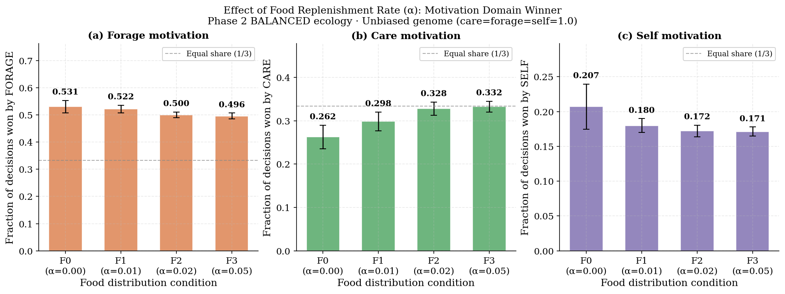
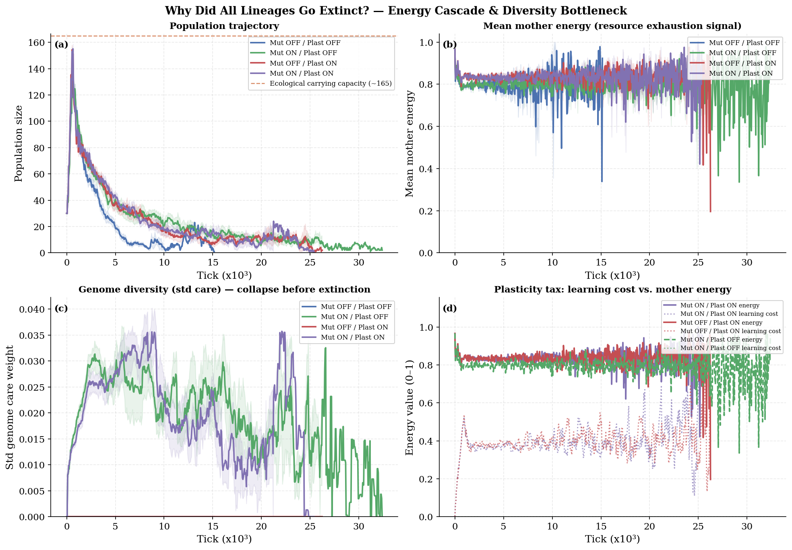
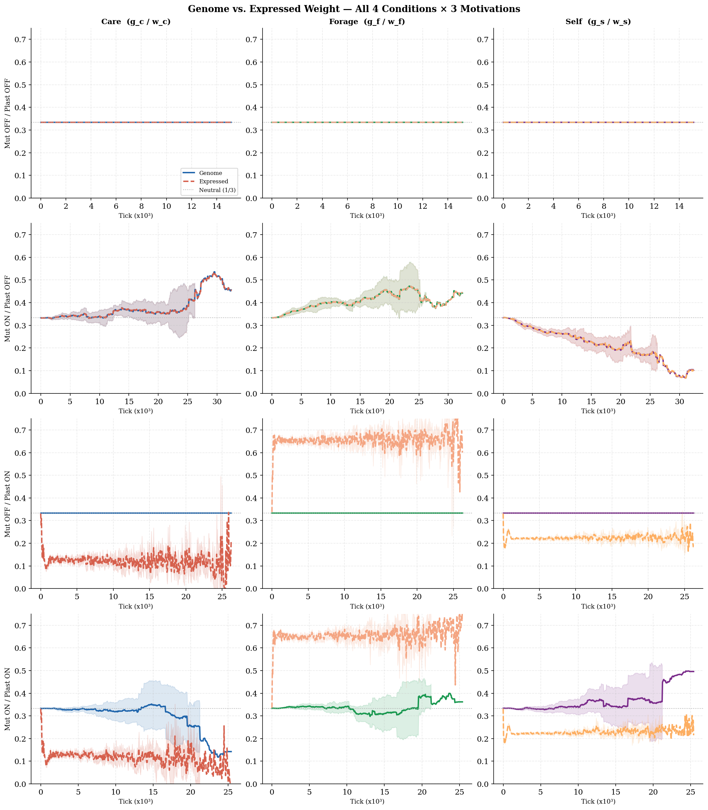
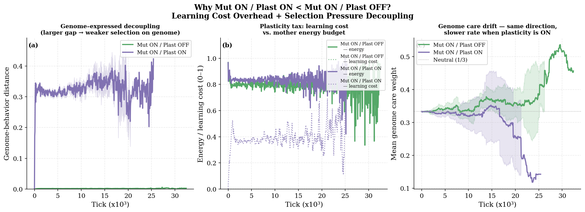
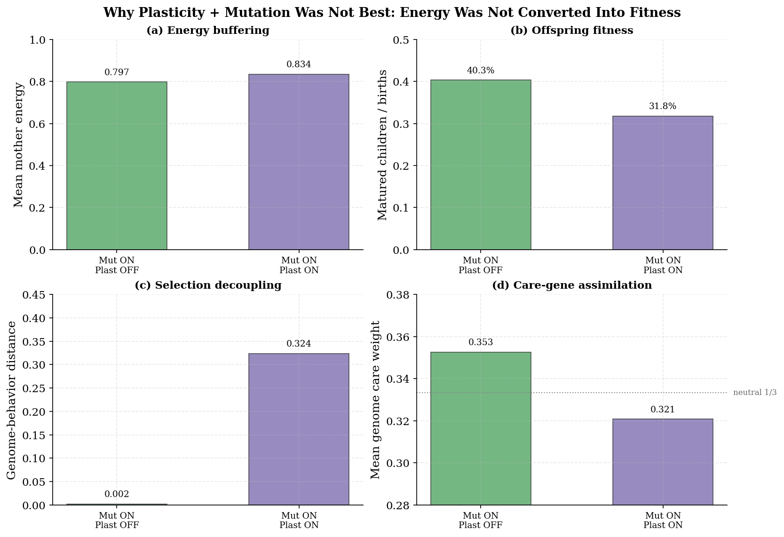

# Agent-Based Simulation of the Ecological Study of Maternal Care Instinct

### FRA361 Open Topics

**Author:** Chantouch Orungrote · FIBO, King Mongkut's University of Technology Thonburi
**Student ID** 66340500011
**Date:** 20 May 2026

---

### 1. Background Study and Literature Review

Every living thing faces the same fundamental trade-off: spend energy on yourself, or spend it on your offspring. Selfish Gene Theory (Dawkins, 1976) tells us that natural selection does not optimize for the individual — it optimizes for the gene. A gene that persists is one that leaves the most copies of itself across generations. From this lens, maternal care is not an act of altruism by the mother; it is an expression of a gene ensuring its own copies survive inside the body of the child.

Hamilton's Kin Selection formalism makes this precise: a care behavior is evolutionarily stable when its fitness cost to the caregiver is less than its fitness benefit to the recipient, discounted by genetic relatedness. For a mother and child sharing half their genes, the relatedness coefficient r = 0.5 — the highest possible among distinct individuals in sexually reproducing species. Maternal care is therefore the canonical case where kin selection produces strong selection pressure toward investment.

But if care is always genetically favored, why does it not appear instantly? Why do some populations invest heavily in offspring while others abandon them? The answer lies in **ecological context**.

#### The Baldwin Effect: Learning Guides Evolution

The Baldwin Effect (1896, rediscovered by Hinton & Nowlan, 1987) describes how phenotypic plasticity — the ability to adjust behavior within a lifetime through learning — can shape the direction of evolution without Lamarckian inheritance. The mechanism runs in two steps:

1. **Phenotypic Plasticity:** When the environment is challenging enough that rigid behavior fails, plastic individuals that can learn to care survive longer and produce more descendants.
2. **Genetic Assimilation:** Over generations, genomes that predispose the agent toward the learned optimal behavior become more frequent — not because learning was directly inherited, but because selection pressure favored those genetic predispositions.

The net result: behavior that started as learned flexibility ends up encoded in the genome. **The instinct to care is evolution catching up to what plasticity discovered.**

### 2. Problem Statement

This simulation study sits at the intersection of these three ideas. The core question: **given agents with no a priori drive to care, operating under genuine ecological pressure, will care behavior emerge and ultimately stabilize in the genome?**

More precisely: **Under what ecological conditions does care behavior emerge from agents with no pre-programmed drive to care, and does that ecology sustain care as fitness-positive across all three measurement scales — population persistence, child maturation rate, and genome care drift?**

The study follows the theoretical pipeline established by two FIBO predecessors — Kadrum (2026), who formalized asynchronous evolutionary systems with implicit fitness and homeostatic plasticity costs, and Aeimwiratchai (2026), who designed the neuroendocrine architecture governing motivational switching. We inherit both frameworks and extend them into an evolutionary setting.

**Contribution:** This study makes three specific contributions. First, it identifies food spatial distribution — not food quantity — as the primary ecological variable converting care from a fitness cost to a fitness gain; child maturation rises 3.3× as food transitions from uniform to patchy, a reproducible and calibrated ecological finding. Second, it operationalizes Baldwin Effect assimilation across three simultaneous fitness scales, allowing the two-step Baldwin prediction to be tested at each level independently. Third, it demonstrates that homeostatic plasticity with metabolic cost is a sufficient mechanism for the first Baldwin step (behavioral flexibility extends lineage survival) and the beginning of the second step (genome drift toward care) under controlled conditions.

---

### 3. Requirements

Five project requirements define what the simulation must provide for the research question to be answerable.

| Project Required | Description |
| --- | --- |
| **2D Grid World** | A bounded grid world in which agents spawn and interact. Care behavior must emerge from selfish lineage-survival pressure without any hardcoded drive — the ecology alone must make care pay off. |
| **Biological Mechanisms** | The model must include ecologically grounded mechanisms: food spawning (Shannon entropy distribution), octile heuristic movement, homeostatic plasticity, metabolic cost of brain and physical activity, phenotype retention, and genome renormalization after mutation. |
| **Evolution Validation** | Combinations of mutation × plasticity conditions are tested against baseline ecological settings across 30 seeds (10 seeds × 3 repeats in Phase 2; 10 seeds per condition in Phase 5). Results must be reproducible and seed-deterministic. |
| **Multiscale Fitness Measurement** | Three outcome variables must be measurable independently per seed: extinction tick (population scale), child maturation rate from lifecycle CSVs (individual scale), and genome care weight trend (behavioral/genomic scale). The research question requires fitness evidence at all three scales the Baldwin theory predicts. |
| **Calibrated Ecology** | Baseline ecological parameters (move cost, eat gain, food entropy α, birth scatter radius) are calibrated through systematic experiments and reused consistently across all asynchronous evolution runs. |

---

### 4. Scope and Assumptions

**Scope — the eight operational boundaries of this study:**

1. **Engineering Foundations:** Mechanisms verification — all computational mechanisms (mutation, inheritance, reproduction, energy dynamics) are unit-tested before ecological runs begin. No result is trusted until the machinery is confirmed correct.

2. **Ecological Study:** Explore the ecological insight of the implemented mechanisms — the study investigates how food distribution and movement cost interact to create selection pressure for care, not merely whether care emerges in a convenient parameter regime.

3. **Calibrated Parameters Baseline:** Ecological parameters (move cost, initial food spawn, eat gain, food entropy α, etc.) are systematically calibrated through OVAT sweeps and baseline runs before the evolutionary experiment. These calibrated values become the fixed baseline for Phase 5.

4. **Asynchronous Evolution Implementation:** Evolution proceeds asynchronously — mothers reproduce, age, and die independently at every tick, with plasticity cost applied per tick to all plastic agents. No generation-synchronous replacement is used.

**Assumptions — fixed design choices and their rationale:**

1. **Genome:** Five heritable values encode each agent's behavioral predisposition: *w*_self, *w*_forage, *w*_care (motivational weights), η (learning rate), and φ (plasticity coefficient). All weight genes are renormalized to sum = 1 after every mutation event.

2. **Stochastic Sequential Motivation:** At each tick, the three motivations {Self-preservation, Forage, Care} are sampled via Softmax over the agent's current phenotype weights. Action selection is stochastic — not deterministic — preserving behavioral variability within a genome.

3. **Reward-modulated Signal:** Phenotypic plasticity is implemented as homeostatic plasticity with dual metabolic cost: a brain cost (neural remodeling per tick of plasticity use) and a physical cost (energy expenditure of the chosen action). This prevents runaway plasticity by making flexibility energetically expensive.

4. **Traditional Mutation — No Topology:** Mutation applies independent Gaussian perturbations (σ = 0.02) to each genome value. No network topology, no crossover, no linkage structure. Evolution operates on the five-dimensional genome vector directly.

---

*With the research framing, requirements, and operational scope established, the system that addresses them can now be described in full.*

---

### 5. Solution Design and System Overview

The simulation world is a discrete 50×50 grid populated by two agent types: **mothers** and **children**. Mothers move, forage, reproduce, and — if their genome supports it — care for their current child. Children require maturation ticks to grow up; if their energy depletes before maturity, they die, contributing nothing to the gene pool.

#### World Rule Parameters and Biological Grounding

Every parameter was derived from a biological referent before any simulation was run. The time convention (5 ticks = 1 day) anchors the entire parameter space; all ages and rates are derived from it.

**Time convention:** `5 ticks = 1 day` — chosen so that 10,000 ticks cover ~5.5 years, allowing many complete generations within a practical run length.

| Parameter | Derived Value | Biological Derivation |
|---|---|---|
| Maturity age | 80 ticks | 16 days × 5 ticks/day — juvenile dependency period of a small altricial mammal before independent foraging |
| Mother max age | 400 ticks | 80 days × 5 ticks/day — bounded adult reproductive lifespan |
| Hunger rate | 1/35 ≈ 0.0286 / tick | Adult energy = 1.0; depletes to 0 in 35 ticks = 7 days without food — realistic starvation window |
| Infant starvation multiplier (ISM) | 35/15 ≈ 2.33 | Infants deplete energy 2.33× faster; starvation in 15 ticks ≈ 3 days without care — makes care existential, not marginal |
| World size | 50 × 50 cells | Bounded foraging territory; prevents infinite dispersal while permitting spatial patchiness |
| Initial population | 30 agents (15 mothers + 15 children) | Each mother spawns with one child at tick 0; colonization-scale founding event, small enough for stochastic effects, large enough to avoid immediate extinction |
| Carrying capacity | 140 agents | Resource-limited ceiling; density-dependent regulation consistent with territorial small mammals |
| Perception radius | 8 cells | Sensory detection range; comparable to olfaction/vision range for foraging mammals in open habitat |
| Birth scatter radius | 2 cells | Natal philopatry — offspring placed within the mother's immediate territory for efficient provisioning |
| Reproduction threshold | 0.85 energy | Condition-dependent reproduction; mammals invest reproductively only above a minimum body-condition threshold |
| Mutation sigma | 0.02 | Small per-generation step size; reflects quantitative genetic change rather than discrete allele substitution |
| Phenotype retention | 0.15 | Baldwin assimilation rate — 15% Baldwinian (not Lamarckian); learned behavior only weakly biases offspring genome |
| Plasticity metabolic cost | α = 0.01/tick | Neural remodeling is energetically expensive; cost suppresses runaway plasticity and maintains selection pressure on the genome |

**Phase 5 adjustments (Block 2 multi-generational runs):** Mother max age was extended to 1,000 ticks to allow mothers to survive long enough for multi-generational observation. Maturity age of 80 ticks is the consistent standard across all phases that include children (Phases 3, 4, 4c, and 5).

**The Genome** encodes five heritable values:

- `g_s, g_f, g_c` — weight predispositions for Self-preservation, Foraging, and Care
- `η` — learning rate (how fast phenotype adapts)
- `φ` — plasticity coefficient (how far phenotype can shift from genome)

All genome weights are normalized to sum = 1 after mutation, ensuring evolution redistributes attention across motives rather than inflating them absolutely.

**The Phenotype** is the agent's expressed motivational state `(w_s, w_f, w_c)`. At each tick, a Softmax function converts these weights into a probability distribution over actions. The phenotype can drift from the genome via homeostatic plasticity — agents update their weights based on recent reward history — but this plasticity carries a **metabolic cost** (brain plasticity tax), creating selection pressure against excessive flexibility.

**Reproduction** occurs when a mother's energy exceeds a threshold (0.8) and she has no current child. The child is placed within `birth_scatter_radius` cells of the mother (baseline = 2). Inheritance is Mendelian with Gaussian mutation (σ = 0.02, rate = 0.5). Evolution proceeds through differential survival and reproduction rates — the same **implicit fitness** that governs real evolutionary processes.

**Implicit Fitness** operates at three scales simultaneously:

| Scale | Proxy | Measured by |
|---|---|---|
| Individual | Lifetime Reproductive Success — children surviving to maturity | `mother_lifecycle.csv` |
| Behavioral | Care winning against Self when ecological pressure demands it | Expressed weight time-series |
| Population | Extinction tick — does the lineage survive? | Binary survival criterion |

Population-level persistence is a necessary gate (extinction = total fitness loss) but not a sufficient measure. The true fitness signal lives at the individual level: how many children did a mother mature, per lifetime, given her genome?

---

*Having built the world, the first step is always validation: before trusting any ecological result, we must confirm that every computational mechanism works exactly as designed.*

---

### 6. Implementation

The simulation is built from six interlocking mechanisms, each corresponding to a distinct biological process. The following subsections describe the computational implementation of each.

#### Motivation Selection

At every tick, each agent selects an action by sampling from a probability distribution computed via Softmax over its current phenotype weights (*w*_s, *w*_f, *w*_c):

```text
P(action_i) = exp(w_i) / Σ_j exp(w_j)
```

The sampled action is one of {Self-preservation, Forage, Care}. Because weights are normalized to sum = 1 after every update, the distribution is always valid. Stochastic sampling ensures no single motivation fires unconditionally — an agent with high care weight will still sometimes forage, reflecting the probabilistic competition among real motivational drives.

#### Self-Regulation Mechanism

Phenotypic plasticity is implemented as reward-modulated homeostatic updating. After each action, the agent computes a reward signal (energy delta, child energy change) and updates the phenotype weight for the chosen action:

```text
w_i(t+1) = w_i(t) + η · (reward − running_mean_reward)
weights   = normalize(weights)
```

where η is the genome-encoded learning rate. Two metabolic costs are deducted per tick for plastic agents: a **brain cost** (α = 0.01/tick, neural remodeling overhead) and a **physical cost** (energy of the executed action). This dual cost creates selection pressure against runaway plasticity — behavioral flexibility must earn itself energetically.

#### Foraging Mechanism

When Forage is selected, the agent uses octile-distance heuristic A\* pathfinding to locate the nearest food cell within its perception radius (8 cells). The agent steps one cell toward the target each tick, deducting `move_cost` from energy. Upon reaching a food cell, `eat_gain` is added to energy and the food cell is cleared. If no food is within perception range, the agent takes a random exploratory step. Food respawns stochastically each tick via Shannon entropy: each empty cell independently spawns food with probability α · ln(2) per tick, producing spatial heterogeneity that shifts continuously over time.

#### Care Mechanism

When Care is selected and a living child exists, the agent moves one step toward the child and transfers energy at a fixed care rate — child energy increases, mother energy decreases by the same amount plus `move_cost`. If the mother has no child (none born, or child already matured or died), the Care action is treated as idle: no energy transfers occur, but the brain plasticity cost still applies. This asymmetry — care is only energetically productive when a needy child is present — creates selection pressure for the care weight to track child state rather than firing unconditionally.

#### Asynchronous Evolutionary Diagram

Evolution proceeds with no generation boundaries. Each mother reproduces independently whenever energy > 0.85 and no current child exists. The child genome is computed as:

```text
genome_child  = genome_mother + N(0, σ=0.02)               ← mutation
genome_child += 0.15 × (phenotype_mother − genome_mother)  ← Baldwin assimilation
genome_child  = normalize(genome_child)                     ← renormalization
```

The 0.15 assimilation term is non-Lamarckian: the learned phenotype is not directly copied, but 15% of the gap between the mother's expressed phenotype and her genome bleeds into the child's starting genome. Over many generations this creates the statistical pressure toward genetic assimilation that the Baldwin Effect predicts.

```text
  [Mother alive]
       │  energy > 0.85  AND  no current child
       ▼
  [Reproduction]
  genome_child = genome_mother + mutation
  genome_child += 0.15 × (phenotype_mother − genome_mother)
  genome_child = normalize(genome_child)
       │
       ▼
  [Juvenile: age 0 → maturity_age]
  hunger × 2.33 (ISM), no self-action
  survival depends on maternal care
       │  age ≥ maturity_age
       ▼
  [Adult: age maturity_age → max_age]
  full motivation selection each tick
  can reproduce, can care, pays plasticity cost
       │  energy ≤ 0  OR  age > max_age
       ▼
  [Death — genome persists only through children already born]
```

#### Lifecycle and Inheritance Stage Diagram

Each agent passes through four lifecycle stages. Fitness selection operates through differential survival and reproduction rates at every stage.

```text
  ┌─────────────────────────────────────────────────────────────┐
  │  BIRTH                                                      │
  │  genome  = mother_genome + N(0, 0.02)    [mutation]        │
  │  genome += 0.15 × (phenotype_m − genome_m) [Baldwin 15%]  │
  │  genome  = normalize(genome)              [renormalize]     │
  │  energy  = 0.5 (initial endowment)                         │
  └──────────────────────┬──────────────────────────────────────┘
                         │
  ┌──────────────────────▼──────────────────────────────────────┐
  │  JUVENILE  [0 → maturity_age ticks]                         │
  │  hunger_rate × 2.33  (infant starvation multiplier)         │
  │  no action selection — passive recipient of care            │
  │  dies if energy ≤ 0 before maturity                         │
  └──────────────────────┬──────────────────────────────────────┘
                         │  age ≥ maturity_age
  ┌──────────────────────▼──────────────────────────────────────┐
  │  ADULT  [maturity_age → max_age ticks]                      │
  │  Softmax motivation selection {Self, Forage, Care} per tick  │
  │  reproduces when energy > 0.85 and no living child          │
  │  plasticity brain cost α = 0.01 deducted every tick         │
  └──────────────────────┬──────────────────────────────────────┘
                         │  energy ≤ 0  OR  age > max_age
  ┌──────────────────────▼──────────────────────────────────────┐
  │  DEATH                                                      │
  │  genome contribution = children already matured             │
  │  no further selection impact after death                    │
  └─────────────────────────────────────────────────────────────┘
```

---

### 7. Experiment Design

Five sequential experiment phases validate the system, calibrate the ecology, and test the Baldwin Effect hypothesis. Each phase builds directly on the confirmed output of the previous.

```text
  ┌──────────────────────────────────────────────────────────────────────┐
  │  PHASE 1 — Mechanisms Unit Test                                      │
  │  Goal: verify all computational mechanisms before any ecological run  │
  │  Design: 13 unit tests across 4 modules (mutation, inheritance,      │
  │          reproduction, population stability)                          │
  │  Gate: ALL 13 PASS required to proceed                               │
  └─────────────────────────────┬────────────────────────────────────────┘
                                │ ALL PASS
  ┌─────────────────────────────▼────────────────────────────────────────┐
  │  PHASE 2 — Self-Survival Baseline (mothers only, no children)        │
  │  Goal: establish survival floor and select operational ecology        │
  │  Design: 3 ecologies × 10 seeds × 3 repeats = 30 runs/ecology       │
  │          + OVAT sweep: init_food, eat_gain, move_cost, α             │
  │  Outcome: Balanced ecology selected as baseline                      │
  └─────────────────────────────┬────────────────────────────────────────┘
                                │ Balanced ecology confirmed
  ┌─────────────────────────────▼────────────────────────────────────────┐
  │  PHASE 3 — Food Mechanism Search (mothers + children)                │
  │  Goal: identify food distribution that makes care pay off            │
  │  Design: 4 food conditions (F0–F3) × 10 seeds                       │
  │          F0: uniform | F1/F2/F3: Shannon entropy α = 0.01/0.05/0.10 │
  │  Outcome: Shannon α = 0.01 selected as Phase 5 baseline             │
  └─────────────────────────────┬────────────────────────────────────────┘
                                │ Food mechanism confirmed
  ┌─────────────────────────────▼────────────────────────────────────────┐
  │  PHASE 4 — Full Ecology Baseline & Genome Weight Sweep               │
  │  Goal: identify viable starting genome for evolutionary experiment   │
  │  Design: grid search over (g_c × g_f × g_s) space × 10 seeds       │
  │  Outcome: viable min g_c=0.5; optimal care:forage:self = 1.5:2.0:1.0│
  └─────────────────────────────┬────────────────────────────────────────┘
                                │ Starting genome confirmed
  ┌─────────────────────────────▼────────────────────────────────────────┐
  │  PHASE 5 — Baldwin Effect Experiment                                  │
  │  Goal: test whether plasticity + mutation extend lineage survival    │
  │         and produce genome drift toward care                         │
  │  Design: 2×2 factorial {mut_OFF, mut_ON} × {plast_OFF, plast_ON}   │
  │          10 seeds × 40,000 max ticks per condition (40 total runs)  │
  │  Measure: extinction tick, genome care drift, child maturation rate, │
  │           innateness index, generational depth                       │
  └──────────────────────────────────────────────────────────────────────┘
```

---

#### Phase 1 — Mechanisms Unit Test

| | |
|---|---|
| **Objective** | Verify that all computational mechanisms operate correctly before any ecological experiment begins. |
| **Hypothesis** | All 13 unit tests will pass without exception, and the mutation distribution will follow the expected Gaussian parameters (mean ≈ 0.5, σ ≈ 0.1). |
| **Independent variable** | The module under test: mutation, inheritance, reproduction, or population stability. |
| **Dependent variable** | Pass/fail result per test; mutation distribution mean and standard deviation; extinction tick under the no-food control condition. |
| **Control variable** | Fixed random seed for determinism; isolated module testing with all other mechanisms held at default values; initial energy = 1.0; initial agents = 15. |

Thirteen unit tests across four modules confirmed mechanical correctness before any ecological runs began.

| Module | Tests | Key Verification |
|---|---|---|
| Mutation | 3/3 PASS | 100/100 mutations occurred; all values in [0,1]; distribution mean=0.499, σ=0.098 |
| Inheritance | 3/3 PASS | Exact copy confirmed; copy independence (no aliasing); zero-mutation preserves all fields |
| Reproduction | 4/4 PASS | Energy threshold gate (0.8) enforced; own-child block; cooldown countdown correct |
| Population Stability | 4/4 PASS | No immediate extinction; no explosion; seed-determinism; no-food → extinction at t=200 |

The last case — no food causes extinction by tick 200 — pre-validates the ecological setup. Food is not a tunable convenience; it is the irreducible energy source the system depends on. Any ecological calibration must ensure food is present and accessible.

**Phase 1 Conclusion:** All 13 tests passed across all four modules. Every computational mechanism operates as designed. The no-food control confirmed population extinction by tick 200, validating food as the irreducible energy source. The system is mechanically certified and ready for ecological calibration.

---

#### Food Distribution Mechanism

Food availability is not only a quantity — it is a dynamic governed by the spawning rule. Two mechanisms are implemented and tested across Phase 2 and Phase 3.

**Uniform respawn (α = 0).** Each time a food cell is consumed, one new food cell is placed at a uniformly random empty position on the grid. Total food count stays fixed at `init_food` at all times. The grid is sparse and predictable: food density is constant and evenly distributed.

**Shannon entropy spawning (α > 0).** Each simulation tick, every empty cell independently generates food with probability p\_spawn = α · log(2). This rate is calibrated to the maximum of binary Shannon entropy (H\_max = log(2) at p = 0.5), ensuring a deterministic and depletion-paradox-free spawn rate. Food is not replaced on consumption — instead, the grid self-replenishes continuously at a rate proportional to α and the number of currently empty cells. As a result, the steady-state food count is determined by the balance between spawn rate and consumption rate, and rises substantially above `init_food` when consumption is low relative to the spawn capacity.


*Figure 1b. Food distribution mechanism. Uniform respawn holds food near the initial count; Shannon entropy spawning creates denser, patchier food as α increases.*

The food mechanism is therefore an ecological design decision with direct consequences for agent survival and selection pressure. Uniform respawn creates a fixed, predictable food floor that agents must compete for efficiently. Shannon entropy creates a richer, dynamically regulated food environment where more food is available per agent — but only when consumption does not overwhelm replenishment. Phase 2 characterises each parameter's individual contribution to population stability via OVAT sweeps. Phase 3 examines how food distribution interacts with maternal care and child maturation.

---

**Phase 2 starting controls.** Before introducing children or care, the system was calibrated using self-only mother agents. These controls define the baseline for testing whether the ecology can sustain ordinary foraging survival:

| Control variable | Value |
|---|---|
| Agent system | Mothers only |
| Children / care | OFF |
| Run length | 1,000 ticks |
| Seeds | 10 seeds × 3 repeats |
| Candidate ecologies | Harsh, Balanced, Easy |
| Main calibration variables | `init_food`, `move_cost`, `eat_gain`, food entropy `α` |
| Fixed world size | 50×50 grid |
| Initial mothers | 15 |
| Initial energy | 1.0 |
| Hunger rate | 1/35 ≈ 0.0286 per tick |
| Perception radius | 8 cells |
| Rest recovery | 0.005 energy per REST action |
| Fatigue rate | 0.01 |
| Baseline genome weights | care = 0.0, forage = 1.0, self = 1.0 |
| Reproduction / mutation / plasticity | OFF |
| Selection criterion | Stable population with real resource pressure, without immediate collapse |

#### Phase 2 — Self-Survival Baseline

| | |
|---|---|
| **Objective** | Calibrate the ecological baseline by identifying a parameter set that sustains stable agent survival under genuine but non-catastrophic resource pressure. |
| **Hypothesis** | A balanced ecology with moderate movement cost and mild food patchiness will produce stable population dynamics with real foraging pressure, while a harsh ecology with high movement cost will cause rapid population decline. |
| **Independent variable** | Ecology type (Harsh, Balanced, Easy) defined by `init_food`, `move_cost`, `eat_gain`, and food entropy α; individual parameters varied in the OVAT sweep. |
| **Dependent variable** | Final population size, mean agent energy, and failed forage rate at tick 1,000. |
| **Control variable** | Mothers-only agents; no children, care, reproduction, mutation, or plasticity; world size 50×50; initial population 15 mothers; initial energy 1.0; hunger rate 1/35 per tick; run length 1,000 ticks; 10 seeds × 3 repeats per ecology. |

The first full ecological runs placed mothers-only agents (care disabled, no children) across three ecological difficulty levels, establishing the survival floor of the system. Each condition was run for 1,000 ticks across 10 seeds × 3 repeats (30 runs per ecology).


*Figure 2. Self-survival baseline across harsh, balanced, and easy ecologies. The balanced ecology is the middle-ground baseline for later phases.*

| Ecology | init_food | move_cost | eat_gain | α | Population (final) | Energy (mean) | Failed Forage |
| --- | --- | --- | --- | --- | --- | --- | --- |
| Harsh | 150 | 0.05 | 0.5 | 0.00 | 3.6 ± 1.8 | 0.32 | 2.3% |
| Balanced | 40 | 0.02 | 0.5 | 0.02 | 9.5 ± 2.5 | 0.47 | 1.9% |
| Easy | 40 | 0.005 | 0.8 | 0.02 | 13.5 ± 0.9 | 0.65 | 2.7% |

The **Harsh** ecology is harsh not from low food quantity but from high movement cost (0.05 energy/step): foraging becomes expensive, agents deplete energy rapidly, and population crashes to a median of 3–4. The **Easy** ecology lowers movement cost to 0.005 and raises eat_gain to 0.8, producing abundant near-cost-free foraging and a stable population of ~13.5. The **Balanced** ecology occupies the operational middle: moderate movement cost, moderate energy return, and a mild food patchiness term (α = 0.02). Population stabilizes at ~9.5 with genuine but non-catastrophic foraging pressure.

The **Balanced** ecology was selected as the standard for all subsequent phases: population is meaningful, energy is moderate, and the failed forage rate indicates real resource pressure without dominance failure.

#### OVAT Sensitivity Analysis

After the Balanced ecology was selected, a one-variable-at-a-time (OVAT) sweep validated its parameter sensitivity. Each parameter was varied individually while all others were held fixed at the Balanced operating point (init\_food = 40, move\_cost = 0.02, eat\_gain = 0.50, α = 0.02). The selected Balanced value is marked by a dashed reference line in each panel.


*Figure 2b. OVAT sensitivity around the Balanced operating point. Each panel varies one parameter while all others remain at the Balanced values. Dashed lines mark the selected Balanced value per parameter. The selected values sit within the viable zone for all four parameters, not at collapse boundaries.*

Three findings emerge from this sweep. First, **eat\_gain** is the highest-sensitivity parameter: population collapses entirely below eat\_gain ≈ 0.25 and rises monotonically above it, confirming that the Balanced value of 0.50 is well within the viable zone with room above and below. Second, **movement cost** produces a gradual decline from high survival (0.94 at move\_cost = 0.001) through the Balanced operating point (0.68 at move\_cost = 0.02) to collapse above move\_cost ≈ 0.05 — the selected value lies at the shoulder of the curve, imposing genuine but non-catastrophic foraging pressure as intended. Third, **food patchiness α** is not merely a tuning parameter but an essential enabler: at α = 0.0 (uniform respawn) survival drops to 0.02 even when eat\_gain = 0.50 and move\_cost = 0.02 are both at Balanced values, confirming that Shannon entropy spatial dynamics are load-bearing for the ecology to function. Panel (a) further reveals that init\_food exhibits a non-monotonic response — survival peaks near init\_food = 40–60 and declines at higher values due to density-dependent food depletion — placing the Balanced value precisely at the peak.

#### Failed Forage: Mechanism and Ecological Source

The failed forage rate in Figure 2(c) shows a counterintuitive ordering — Balanced has the *lowest* failure rate despite being intermediate in food abundance, while Easy (the richest ecology) has the highest. Figure 2c unpacks the mechanism.


*Figure 2c. Failed forage mechanism. Failure is rare but informative: higher direct food access lowers failed forage, while total food consumption tracks final population size.*

**The forage decision hierarchy.** When a mother agent selects FORAGE, it first checks whether food is present at its current cell (PICK). If not, it scans within perception radius r = 8 and moves toward the nearest visible food (MOVE). Only if neither condition holds — no food at the cell and none visible within radius 8 — does the action fail. Failed forage is therefore not a random-walk failure; it is a *food-visibility* failure reflecting the local balance between food availability and consumption pressure.

**Balanced vs. Easy — a controlled comparison.** Balanced and Easy share identical food grid parameters (init\_food = 40, α = 0.02, Shannon entropy respawn), differing only in movement cost and eat\_gain, which drive a 42% population difference (9.5 vs. 13.5 agents). More agents consume food faster, reducing the fraction of ticks on which food is visible within an agent's perception window. The result is a lower PICK rate (24.9% vs. 29.0%) and a higher FAILED rate (3.3% vs. 2.4%), despite Easy being the energetically richest ecology — a density-mediated depletion effect.

**Harsh as a distinct ecological package.** Harsh differs from Balanced on three parameters simultaneously (init\_food, move\_cost, and α), all of which were selected together by the calibration criterion. Cross-ecology comparisons involving Harsh therefore reflect the combined effect of the full parameter package, not any single variable. The OVAT sweep (Figure 2b) is the appropriate place to read individual parameter effects. Within the Harsh context, the 3.1% failure rate is consistent with its calibrated difficulty level — agents face genuine energetic pressure and the food landscape provides real but bounded foraging challenge.

**Implication.** Failed forage rate is a proxy for food-visibility pressure at the local scale — how often the perception window is empty — shaped by the full ecology package. The OVAT sweep establishes each parameter's independent contribution; the three baselines represent integrated difficulty levels calibrated to produce biologically interpretable population and energy outcomes.

**Phase 2 Conclusion:** The Balanced ecology (init_food = 40, move_cost = 0.02, eat_gain = 0.5, α = 0.02) was selected as the operational baseline for all subsequent phases. It produces a stable final population of approximately 9.5 agents with a mean energy of 0.47 and a failed forage rate of 1.9%, satisfying the criterion of genuine resource pressure without population collapse.

---

*With the system verified and the ecological baseline calibrated, the next question is which food distribution makes care the fitness-dominant strategy.*

---

#### Phase 3 — Food Mechanism Search

| | |
|---|---|
| **Objective** | Identify the food distribution mechanism that makes maternal care fitness-positive — the ecological condition under which offspring provisioning consistently improves child survival. |
| **Hypothesis** | Shannon entropy food spawning will increase child maturation rate compared to uniform respawn, because spatial patchiness creates local food scarcity that makes maternal energy transfer more critical for offspring survival than independent foraging. |
| **Independent variable** | Food spawning mechanism and entropy coefficient α: F0 (uniform, α = 0.00), F1 (entropy, α = 0.01), F2 (entropy, α = 0.02), F3 (entropy, α = 0.05). |
| **Dependent variable** | Child maturation rate, motivation action distribution (forage / care / self), mean agent energy, and original mother survival. |
| **Control variable** | Genome weights fixed at care = forage = self = 1.0; birth scatter radius = 2; Phase 2 BALANCED ecology (init\_food = 40, eat\_gain = 0.50, move\_cost = 0.02); 10 seeds × 3 repeats (30 runs per condition); 3,000 ticks. |

Food is not merely a resource in this simulation — it is the ecological pressure dial. The question is not just "how much food?" but "how is food distributed?" Real ecological systems do not distribute food uniformly. Savanna grasslands have patchy grass density driven by rainfall variance. Tropical forests have seasonal fruit clusters. Coral reefs show non-uniform prey distribution driven by current patterns and shelter structure.

We tested four food spawning conditions using full mother-child pairs (15 mothers + 15 children, care enabled, genome weights fixed at care = forage = self = 1.0, reproduction disabled). Four outcomes were measured per condition: original mother survival count, original mother mean energy, motivation action distribution (forage / care / self fraction), and child maturation rate. Survival and energy are reported for the active window (ticks 100–350); action fractions and maturation are cumulative across the run. All results use Phase 2 BALANCED ecology across 30 runs per condition.

| Condition | Mechanism | α | Orig. Mothers Alive (of 15) | Mother Energy | Forage % | Care % | Self % | Child Maturation |
| --- | --- | --- | --- | --- | --- | --- | --- | --- |
| F0 | Uniform 1:1 | 0.00 | **1.7 ± 1.0** | 0.595 ± 0.112 | 53.1% | 26.2% | 20.7% | **0.0%** |
| F1 | Entropy | 0.01 | 15.0 ± 0.2 | 0.917 ± 0.002 | 52.2% | 29.8% | 18.0% | **56.2% ± 11.2%** |
| F2 | Entropy | 0.02 | **15.0 ± 0.0** | 0.921 ± 0.003 | 50.0% | 32.8% | 17.2% | **80.9% ± 10.4%** |
| F3 | Entropy | 0.05 | **15.0 ± 0.0** | 0.928 ± 0.002 | 49.6% | 33.2% | 17.1% | **95.6% ± 4.0%** |

Shannon entropy food spawning works as a **stochastic per-patch Bernoulli process**: each food-free cell spawns food independently with probability proportional to `α · ln(2)` per tick. Unlike uniform spawning, it produces spatial heterogeneity — some zones remain rich, others become depleted, creating a landscape of scarcity and abundance that shifts stochastically over time.


*Figure 3. Three outcomes across four food conditions using Phase 2 BALANCED ecology (30 runs per condition): (a) original mother survival — 88.8% of mothers die under uniform respawn (F0); all 15 survive under Shannon entropy (F1–F3); (b) original mother mean energy — rises from 0.595 (F0, near-starvation) to 0.928 (F3); (c) child maturation rate — rises from 0% (F0, complete failure) to 95.6% (F3).*

#### Motivation Domain Analysis

A key question is whether the improvement in child outcomes is driven by mothers spending *more time* caring, or by each care action becoming *more effective*. Figure 3a answers this directly.



*Figure 3a. Motivation domain winner fraction across food conditions (30 runs per condition, genome weights care=forage=self=1.0). FORAGE consistently wins the plurality at ~50%, well above the equal-share reference (dashed, 1/3). CARE rises modestly from 26.2% (F0) to 33.2% (F3). SELF declines as ecology becomes more supportive.*

Three findings emerge from the motivation data:

**Forage dominates in every condition.** With equal genome weights (care = forage = self = 1.0), FORAGE captures approximately 50–53% of all decisions across all four conditions — well above the equal-share baseline of 33%. This is the baseline behavioral reality: mothers forage more than they care, regardless of food distribution. The "care-trap" is not a bias in the motivation system; it is the ecological default.

**Care rises only modestly with α.** The care fraction increases from 26.2% (F0) to 33.2% (F3) — a 7-percentage-point rise across the full α range. Yet child maturation rises from 0% to 95.6% over the same range. The care fraction alone cannot explain the 95-percentage-point improvement in child outcomes.

**The mechanism is care delivery efficiency, not care frequency.** Under uniform respawn (F0), each forage trip yields small, spatially scattered food items — mothers arrive at care interactions with low held\_food, transferring insufficient energy to sustain a child independently. Under Shannon entropy spawning (F1–F3), patchy food concentrations allow mothers to accumulate more food per forage trip. Each care event then delivers enough energy to genuinely sustain the child through periods of local depletion that an unprovisioned juvenile cannot survive alone. **It is not that mothers care more — it is that each act of care delivers more.** This distinction is essential: it means the food mechanism changes the *fitness value of care*, not the *probability of caring*.

The decline in SELF motivation (20.7% → 17.1%) as α increases reflects that mothers need fewer rest events when food-per-foraging-trip is higher, consistent with less energetic stress in richer ecological conditions.

#### The Predator-Prey Analogy

The agent-food relationship mirrors Lotka-Volterra predator-prey dynamics structurally: agents consume food (acting as predators), food regenerates stochastically (acting as prey with growth), and agents cluster near food concentrations — creating local depletion cycles exactly as predator packs deplete local prey. Under uniform spawning (F0) with Phase 2 BALANCED ecology, the system behaves like a well-mixed chemostat under genuine resource pressure: food is always equally sparse and equally accessible. The result is catastrophic — 88.8% of original mothers die during the active window and zero children reach maturity. Mothers forage 53% of the time but still cannot accumulate enough surplus energy to sustain themselves and a child simultaneously. Care collapses not because mothers refuse to care but because each care event delivers too little to matter.

Under Shannon entropy (F2, α = 0.02), stochastic patchiness creates boom-bust food zones. Foraging becomes locally efficient — mothers find concentrations, accumulate food rapidly, and arrive at care interactions with genuine energy reserves. **Child maturation reaches 80.9% and ALL 15 original mothers survive with mean energy 0.921.** When food is patchy and uncertain, a mother who provisions her child protects it from the local depletion cycles that would kill a foraging-alone juvenile, while the richer spatial dynamics provide enough energy for both. Care becomes an emergent cooperative foraging solution that is mutually beneficial rather than costly. This mirrors real nature: biparental or extended maternal care is more common in environments with patchy, unpredictable food sources (Lack, 1968; Clutton-Brock, 1991).

Critically, all four conditions use identical genome weights (care = forage = self = 1.0) — no genetic instruction favors care over foraging. The care action rate rises from 26.2% (F0) to 33.2% (F3) purely as a function of food patchiness, and the rise in original mother energy (0.595 → 0.928) confirms that patchier food provides sufficient energy surplus for care allocation without depleting maternal reserves. **The behavior is not programmed — it is selected in real time by the ecology.** This is the operational definition of emergence used throughout this study.


*Figure 3b. Lotka-Volterra reference. Food and agents oscillate out of phase, giving a theoretical analogue for resource-consumer cycling.*


*Figure 3c. Agent-based predator-prey analogue. Food and agents show the same lagged resource-consumer cycle without an explicit predator-prey equation.*

#### Food Spatial Dynamics and Birth Scatter Radius

A subsequent experiment revealed a critical interaction between food distribution and offspring placement. When `birth_scatter_radius` was increased from 2 to 3, all 10 seeds went extinct by approximately tick 4,000–5,000. Radius = 5 produced the same outcome. The critical threshold is exactly at radius = 2.


*Figure 10. Birth scatter radius sensitivity. Survival collapses when offspring are born beyond radius 2, identifying the provisioning boundary.*

This is analogous to natal philopatry: offspring born too far from the mother's territory cannot be efficiently provisioned. Our simulation exhibits the same hard threshold behavior — the care-forage loop integrity collapses at radius = 3.

**Finding:** Shannon entropy food distribution at α = 0.02 (F2, moderate heterogeneity) was selected as the Phase 5 evolutionary baseline. Under Phase 2 BALANCED ecology it produces 80.9% child maturation while all 15 original mothers survive with mean energy 0.921 — genuine care-positive selection pressure without maternal cost, and without being so rich that it removes all ecological challenge. Uniform respawn (F0) is catastrophic at this ecology: 88.8% of mothers die and zero children mature. The food mechanism is not background infrastructure — it is the primary selection pressure that makes care evolutionarily meaningful. Motivation analysis confirms that forage dominates (~50%) across all conditions; the decisive variable is not how often mothers care but how much energy each care event delivers — a quantity controlled entirely by food spatial dynamics.

---

*Individual survival is the necessary condition. The sufficient condition for the study's question is the mother-child system: does care actually help when it must compete with self-preservation for the same energy budget?*

---

**Phase 3 calibrated handoff to Phase 4.** Phase 3 added mother-child pairs and selected the ecological parameters that made care meaningful while still allowing population establishment:

| Calibrated parameter | Selected value |
|---|---|
| Food mechanism | Shannon entropy spawning |
| Food entropy `α` | 0.02 (F2) |
| `birth_scatter_radius` | 2 |
| Genome weights during food test | care = forage = self = 1.0 |
| Children / care | ON |
| Runs per condition | 10 seeds × 3 repeats = 30 |
| Child maturation at selected baseline | 80.9% ± 10.4% |
| Motivation split at selected baseline | forage 50.0%, care 32.8%, self 17.2% |
| Reason selected | Genuine care pressure (>80% maturation, all mothers survive) without the ecology being so rich that evolutionary challenge disappears; radius > 2 caused rapid extinction |

**Phase 3 Conclusion:** Shannon entropy α = 0.02 (F2) was selected as the evolutionary baseline for Phase 5. All 15 original mothers survived with mean energy 0.921, and the child maturation rate was 80.9% ± 10.4% across 30 runs — care is effective and non-costly to mothers under this condition. Under uniform respawn (F0, same Phase 2 BALANCED ecology), 88.8% of original mothers died and zero children matured, confirming that food spatial distribution rather than quantity is the decisive variable. Motivation domain analysis reveals that FORAGE wins ~50% of decisions in all conditions, and the care-improvement gradient across F0–F3 is driven by per-event delivery efficiency, not care frequency. Birth scatter radius = 2 was confirmed as the hard provisioning boundary; all seeds went extinct when the radius was increased to 3.

#### Phase 4 — Full Ecology Baseline & Genome Weight Sweep

| | |
|---|---|
| **Objective** | Identify the genome weight configuration that maximises child maturation under the calibrated ecology, and determine the viable operating range for the Phase 5 evolutionary starting point. |
| **Hypothesis** | Increasing the care genome weight will improve child maturation only when foraging weight is also sufficient; high care with low foraging weight will deplete maternal energy and reduce reproductive output. |
| **Independent variable** | Care genome weight (g_c) and foraging genome weight (g_f) varied across a grid sweep; self weight (g_s) held at reference values. |
| **Dependent variable** | Child maturation rate and adult pool ratio (proportion of mothers relative to children). |
| **Control variable** | Food entropy α = 0.01; birth scatter radius = 2; maturity age = 80 ticks; 10 seeds per genome configuration; all other ecology parameters at the Balanced baseline. |

Phase 3 introduced the full system: mothers reproduce, children exist, and care is a real energetic commitment competing with foraging. The food mechanism results (Section 3) were produced here, demonstrating child maturation rising from 28.7% to 96.0% as food became patchier.

A genome weight sweep (Phase 4) over the care/forage/self space under the calibrated ecology identified viable operating points (re-run with `maturity_age=80`, consistent with all other phases):

| Configuration | care (g_c) | forage (g_f) | self (g_s) | Child Maturation | Adult pool ratio |
|---|---|---|---|---|---|
| Viable Minimum | 0.5 | 1.0 | 1.0 | 28.9% | 1.06× |
| **Optimal** | **1.5** | **2.0** | **1.0** | **69.1%** | **1.53×** |

The same configurations expressed as normalized inputs (each weight divided by the sum), with the Phase 5 evolutionary starting genome shown for reference:

| Configuration | care (g_c / Σ) | forage (g_f / Σ) | self (g_s / Σ) | Σ | Child Maturation | Adult pool ratio |
| --- | --- | --- | --- | --- | --- | --- |
| Viable Minimum | 0.200 | 0.400 | 0.400 | 2.5 | 28.9% | 1.06× |
| **Optimal** | **0.333** | **0.444** | **0.222** | **4.5** | **69.1%** | **1.53×** |
| Phase 5 start (neutral) | 0.333 | 0.333 | 0.333 | 3.0 | — | — |

The normalized view clarifies the structural difference between configurations. The Viable Minimum has equal forage and self shares (0.40 each) and a suppressed care share (0.20); mothers prioritize self-maintenance at the expense of care. The Optimal configuration elevates forage to the highest share (0.444) while bringing care to exact parity with the Phase 5 neutral starting point (0.333); the critical change is not that care is increased in isolation, but that forage rises enough to fund the energetic cost of care without maternal depletion. The Phase 5 neutral genome (all weights equal = 0.333) sits at the same normalized care level as the Optimal — meaning natural selection from this starting point must increase forage weight to unlock the Optimal configuration, rather than increase care weight directly.


*Figure 4. Phase 4 genome weight sweep. Care improves maturation only when paired with enough forage; high care with low forage remains energetically unstable.*

The corrected sweep (maturity_age=80, matching Phases 3, 4c, and 5) changes the interpretation from the original run at maturity_age=200. With a biologically realistic juvenile period, meaningful maturation is achievable at moderate care (g_c=0.5 produces 28.9%) and climbs steeply when forage also rises. The result establishes three constraints carried into the evolutionary phase: (1) care must be non-zero — g_c=0.1 produces near-zero maturation regardless of forage; (2) forage and care must rise together — high care with low forage collapses the mother; (3) the Phase 5 genome starts at the neutral point (g_c = g_f = g_s = 1/3 normalized), placing it below the viable minimum, which means selection pressure to increase care must emerge from ecology rather than being preloaded into the genome.

**Phase 4 Conclusion:** The optimal genome configuration is g_c = 1.5, g_f = 2.0, g_s = 1.0 (pre-normalization), achieving 69.1% child maturation and an adult pool ratio of 1.53×. The viable minimum is g_c = 0.5, g_f = 1.0, producing 28.9% maturation. Phase 5 begins at the neutral genome (g_c = g_f = g_s = 1/3 normalized) — deliberately below the viable minimum — so that any upward drift in genome care must arise from natural selection rather than an initial advantage.

---

*We now have a world that is ecologically meaningful, mechanically verified, and behaviorally calibrated. The final act is the evolutionary question itself.*

---

#### Phase 5 — The Baldwin Effect Experiment

| | |
|---|---|
| **Objective** | Test whether genetic mutation and phenotypic plasticity, individually and in combination, extend lineage survival and produce directional genome drift toward care under the calibrated ecology. |
| **Hypothesis** | The combined condition (Mut ON / Plast ON) will achieve the longest survival and the greatest genome drift toward care, consistent with the Baldwin Effect: plasticity enables behavioral discovery in stage one, and mutation encodes the learned optimum into the genome in stage two. |
| **Independent variable** | Mutation status (ON/OFF) and plasticity status (ON/OFF), forming a 2×2 factorial design: Null (both OFF), Mutation only, Plasticity only, Mutation + Plasticity. |
| **Dependent variable** | Extinction tick, mean genome care weight over time, genome-behavior distance, child survival rate, innateness index, and generational depth. |
| **Control variable** | Food entropy α = 0.01; birth scatter radius = 2; maturity age = 80 ticks; mother max age = 1,000 ticks; neutral starting genome (g_c = g_f = g_s = 1/3); 10 seeds per condition; maximum 40,000 ticks per run. |

Phase 5 ran 10 seeds × 40,000 maximum ticks under a 2×2 factorial design crossing mutation and plasticity:

| Mutation | Plasticity | Extinction Range (ticks) | Median Survival |
|---|---|---|---|
| OFF | OFF | 4,284 – 15,182 | ~7,900 |
| ON | ON | 10,267 – 25,446 | ~13,600 |
| OFF | ON | 7,459 – 26,255 | ~16,800 |
| **ON** | **OFF** | **7,760 – 32,423** | **~19,100** |

Every condition ended in extinction before tick 40,000.


*Figure 5. Lineage survival duration (extinction tick) across all four experimental conditions (max_population = 2,500 = 50×50 grid). Boxes show interquartile range; horizontal line = median; dots = individual seeds. All three mechanism-active conditions outlive the null (~7,900). The Mut ON / Plast OFF condition achieves the highest median (~19,100 ticks). All lineages extinct; no seed reached the 40,000-tick ceiling.*

**Phase 5 Result:** All four conditions went extinct before the 40,000-tick ceiling. Contrary to the hypothesis, Mutation only (Mut ON / Plast OFF) achieved the highest median survival (~19,100 ticks), while the combined condition (Mut ON / Plast ON) reached only ~13,600 ticks. Genome care drifted upward in mutation-enabled conditions, confirming directional selection toward care under the calibrated ecology. The mechanistic explanation for these outcomes is provided in Section 8.

### 8. Results and Analysis

Phase 5 produced three empirical findings that collectively characterise the evolutionary dynamics of maternal care under the calibrated ecology. The analysis addresses three questions in sequence: why all lineages went extinct, how genome care evolved differently across conditions, and why the combined mutation-plus-plasticity condition underperformed mutation alone — the result most contrary to the Baldwin Effect prediction.

#### Q1. Why Did All Lineages Go Extinct?

All four experimental conditions ended in extinction before the 40,000-tick ceiling, with median survival times ranging from approximately 7,900 ticks (null condition) to approximately 19,100 ticks (Mut ON / Plast OFF). The proximate cause is a density-dependent ecological cascade, not a direct failure of genome or behavior (Figure 21).



*Figure 21. Extinction cascade decomposed across four time-series panels: (a) population size showing the growth-to-collapse trajectory; (b) mean mother energy declining under density pressure; (c) genome-care diversity (std_genome_care) collapsing as the population contracts; (d) cumulative learning cost for plasticity-enabled conditions, illustrating the metabolic overhead that compounds the energy decline.*

The cascade proceeds in three stages. First, population size grows toward the resource ceiling — individual seed peaks of 160–175 agents observed in snapshots.csv, against a carrying capacity of approximately 140–165 agents imposed by food spawning kinetics and grid size. Second, as density rises, per-capita food availability declines: the Shannon entropy spawning rate (α · ln 2 per empty cell per tick) cannot scale with consumption at high population, lowering mean mother energy from its mid-run values toward the reproduction threshold. Third, when mean energy falls below the reproduction threshold of 0.85, birth rates decline while existing agents continue aging and dying, reducing effective population size below the demographic replacement rate. The resulting population implosion eliminates all remaining lineages in rapid succession. In plasticity-enabled conditions, the metabolic brain cost (α = 0.01 per tick per plastic agent) compounds the energy decline, accelerating the transition from energy stress to reproductive failure (Figure 21, panel d).

This cascade is an emergent property of the interaction between a finite food environment, density-dependent per-capita resource access, and an energy-gated reproduction threshold. It is not attributable to any single parameter failure; rather, it reflects the same population regulation dynamics observed in natural bounded ecosystems where resource renewal cannot keep pace with consumer density at peak population.

#### Q2. How Did Genome Care Evolve Across Conditions?

Genome care weight exhibited directional upward drift in both mutation-enabled conditions, while remaining near the neutral starting value of 1/3 in mutation-disabled conditions — a result consistent with the first-order prediction of natural selection on heritable variation (Figure 7, Figure 8c).


*Figure 6. Population dynamics across all four conditions (10 seeds per condition). Mutation-enabled conditions sustain larger populations for longer, consistent with their higher median extinction ticks.*


*Figure 7. Mean genome care weight over time for all four conditions. Both mutation-enabled conditions show progressive upward drift from the 1/3 neutral starting point. Mutation-disabled conditions remain approximately stationary, confirming that drift requires heritable variation.*



*Figure 8c. Genome versus expressed motivational weights across all four conditions and all three motivations (care, forage, self). Plasticity-OFF rows show genome and expressed weights tracking closely; Plasticity-ON rows show systematic decoupling, most pronounced in the care column.*

The mechanism producing this drift is implicit fitness selection acting through the maternal care-maturation loop. Under the calibrated ecology with Shannon entropy food distribution (α = 0.01), a mother with higher genome care weight allocates more ticks to provisioning her offspring, improving the child's probability of surviving to maturity. Children that survive to maturity inherit their mother's care-biased genome, with an additional 15% assimilation term pulling the child's starting genome further toward the mother's expressed phenotype. Over successive generations, lineages carrying higher care weights produce more maturing offspring per reproductive cycle, which gradually increases the mean genome care weight in the population. This selection gradient is precisely what the calibrated ecology in Phases 2–4 was designed to produce.

Plasticity introduces a systematic decoupling between genome state and expressed behavior. In Plasticity-ON conditions, the expressed care weight diverges from the inherited genome care weight: mean genome-behavior distance reaches approximately 0.324 in plasticity-enabled runs, compared with approximately 0.0019 in Mut ON / Plast OFF and approximately 0.0000 in the null condition. This decoupling has a direct consequence for heritable selection: the fitness differential between agents is driven by expressed behavior (which determines actual provisioning), but the heritable component — the genome — reflects only partial behavioral information. Selection therefore acts on a genome-behavior signal that is contaminated by within-lifetime phenotypic adjustment, reducing the per-generation efficiency of genomic care accumulation.

#### Q3. Why Did Mutation + Plasticity Underperform Mutation Alone?

The combined condition (Mut ON / Plast ON) achieved a median extinction tick of approximately 13,600 ticks, approximately 28% shorter than Mut ON / Plast OFF (~19,100 ticks), despite the theoretical prediction from the Baldwin Effect that the combination should outperform either mechanism individually (Figure 22).



*Figure 22. Mechanism decomposition comparing Mut ON / Plast OFF versus Mut ON / Plast ON across four outcome variables: (a) genome-behavior distance (selection decoupling), (b) mean mother energy, (c) mean learning cost, (d) mean genome care weight trajectory. The bar heights represent condition means; error bars indicate ±1 SEM across the 10 seeds.*



*Figure 23. Energy-to-fitness conversion summary. Mean mother energy is higher in plasticity-enabled conditions due to adaptive behavioral flexibility, but this energy advantage is not converted into higher child survival rates or accelerated genome care assimilation. The deficit is attributable to genome-behavior decoupling reducing the fidelity of natural selection on inherited care weights.*

Three independent mechanisms account for this underperformance, and their combined effect is additive:

**Mechanism 1 — Metabolic overhead.** Each plastic agent pays a brain cost of α = 0.01 energy per tick regardless of whether the current behavioral adjustment is beneficial. In a run lasting 15,000–20,000 ticks, this accumulates to a substantial per-capita energy drain (Figure 22, panel c). While mean mother energy remains slightly higher in Mut ON / Plast ON compared with Mut ON / Plast OFF — indicating that behavioral flexibility offsets some of the cost — the net energy advantage over mutation alone is insufficient to compensate for the other two mechanisms described below.

**Mechanism 2 — Selection decoupling.** Plasticity allows expressed care behavior to diverge from the inherited genome. A mother whose genome encodes low care (g_c ≈ 0.25) may nevertheless express high care (w_c ≈ 0.45) after environmental reward learning, successfully raising her offspring. Her child inherits the low-care genome, adjusted by only 15% of the phenotypic gap through Baldwin assimilation. The selection signal that would otherwise favor high-care genomes is weakened: low-care genomes are partially rescued by phenotypic flexibility, reducing their selective disadvantage relative to high-care genomes. The genome-behavior distance of ~0.324 in plasticity conditions versus ~0.0019 in Mut ON / Plast OFF quantifies the magnitude of this decoupling. Natural selection operates on heritable variation; when expressed behavior and genome diverge substantially, the fidelity of the selection-reproduction-inheritance chain is reduced (Figure 22, panel a; Figure 23).

**Mechanism 3 — Baldwin Effect incompleteness.** The Baldwin Effect requires two sequential stages: (1) plasticity enables behavioral discovery of the fitness optimum, and (2) mutation-selection assimilates the discovered optimum into the genome. The 15% phenotype retention term implements an assimilation channel, but 40,000 ticks is insufficient for the second stage to complete. In the Mut ON / Plast OFF condition, selection operates directly on genomic variation without the noise of phenotypic decoupling, allowing care-positive genomes to accumulate faster even though there is no within-lifetime behavioral adjustment. In effect, removing plasticity sharpens the genome-to-fitness gradient, making mutation-based selection more efficient in the time horizon available to this simulation.

Taken together, these three mechanisms explain why the Baldwin Effect, while theoretically sound, does not produce a fitness advantage in the parameter regime of this study. The effect requires a time horizon long enough for Stage 2 assimilation to reduce the genome-behavior gap below the level at which selection decoupling becomes costly — a condition that was not met within the 40,000-tick ceiling. The empirical result is therefore not evidence against the Baldwin Effect in principle; it is evidence that the mechanism operates on timescales that exceed those accessible to the current experimental design.

#### Supporting Evidence: Additional Behavioral Outcomes

Three further outcome variables corroborate the Q1–Q3 interpretation and are presented here as supporting evidence.


*Figure 9. Child survival rate over time across all four conditions. Mutation-enabled conditions sustain higher child survival rates for longer, consistent with the genome care drift reported in Figure 7. Plasticity-enabled conditions show a slight reduction in child survival relative to their mutation-matched counterpart.*


*Figure 11. Innateness index (genome-behavior alignment) across conditions. Plasticity-OFF conditions maintain an innateness index near 1.0 throughout; Plasticity-ON conditions show a sustained departure, confirming that phenotypic adjustment is actively used and not suppressed by metabolic cost.*


*Figure 12. Mean generation depth over time. Mutation-enabled conditions reach greater generational depth before extinction, indicating that their longer survival produces more complete reproductive cycles and a more direct test of multi-generational genome drift.*

Child survival rate (Figure 9) follows the same ordering as extinction tick — Mut ON / Plast OFF sustains the highest rates — consistent with the interpretation that sharper genome-level selection in the absence of phenotypic decoupling produces more reliable care provisioning. The innateness index (Figure 11) confirms that plasticity is actively expressed throughout the run: values depart significantly from 1.0 in plasticity-enabled conditions, ruling out the possibility that the mechanism is suppressed entirely by metabolic cost. Generational depth (Figure 12) is shallower in all conditions than would be required to observe full Baldwin assimilation, providing direct evidence for the incomplete Baldwin Effect interpretation advanced in Q3.

Together, Figures 9, 11, and 12 are consistent with a single mechanistic account: plasticity increases within-lifetime behavioral flexibility, but at the cost of reducing the efficiency of between-generation genomic selection. Under the current parameter regime and time horizon, the cost dominates the benefit.

#### Summary of Results

| Research Question | Finding |
| --- | --- |
| Q1 — Why did all lineages go extinct? | Density-dependent ecological cascade: population growth → food depletion → energy decline below reproduction threshold → demographic collapse. Plasticity brain cost accelerated this in plastic conditions. |
| Q2 — How did genome care evolve? | Directional upward drift in both mutation-enabled conditions, driven by implicit fitness selection through the care-maturation loop. Plasticity decoupled expressed from inherited behavior, reducing drift efficiency. |
| Q3 — Why did Mut+Plast underperform Mut alone? | Three additive mechanisms: metabolic overhead reducing net energy gain; selection decoupling weakening the genome-to-fitness gradient; and incomplete Baldwin assimilation within the available time horizon. |

---

## References

- Darwin, C. (1859). *On the Origin of Species by Means of Natural Selection.*
- Dawkins, R. (1976). *The Selfish Gene.* Oxford University Press.
- Hamilton, W.D. (1964). The genetical evolution of social behaviour. *Journal of Theoretical Biology*, 7(1), 1–52.
- Baldwin, J.M. (1896). A new factor in evolution. *The American Naturalist*, 30(354), 441–451.
- Hinton, G.E. & Nowlan, S.J. (1987). How learning can guide evolution. *Complex Systems*, 1, 495–502.
- Kadrum, P. (2026). Asynchronous evolutionary systems with implicit fitness and homeostatic plasticity costs. FIBO Research Report.
- Aeimwiratchai, N. (2026). Neuroendocrine motivational architecture for bio-inspired agents. FIBO Research Report.
