# Can Maternal Care Emerge from Ecological Pressure?

### A Bio-Inspired Simulation Study — FRA361 Open Topics

**Author:** Chantouch Orungrote · FIBO, King Mongkut's University of Technology Thonburi
**Date:** May 2026

---

## Act I — Foundation

### 1. Background Study and Literature Review

Every living thing faces the same fundamental trade-off: spend energy on yourself, or spend it on your offspring. Selfish Gene Theory (Dawkins, 1976) tells us that natural selection does not optimize for the individual — it optimizes for the gene. A gene that persists is one that leaves the most copies of itself across generations. From this lens, maternal care is not an act of altruism by the mother; it is an expression of a gene ensuring its own copies survive inside the body of the child.

Hamilton's Kin Selection formalism makes this precise: a care behavior is evolutionarily stable when its fitness cost to the caregiver is less than its fitness benefit to the recipient, discounted by genetic relatedness. For a mother and child sharing half their genes, the relatedness coefficient r = 0.5 — the highest possible among distinct individuals in sexually reproducing species. Maternal care is therefore the canonical case where kin selection produces strong selection pressure toward investment.

But if care is always genetically favored, why does it not appear instantly? Why do some populations invest heavily in offspring while others abandon them? The answer lies in **ecological context**.

#### The Baldwin Effect: Learning Guides Evolution

The Baldwin Effect (1896, rediscovered by Hinton & Nowlan, 1987) describes how phenotypic plasticity — the ability to adjust behavior within a lifetime through learning — can shape the direction of evolution without Lamarckian inheritance. The mechanism runs in two steps:

1. **Phenotypic Plasticity:** When the environment is challenging enough that rigid behavior fails, plastic individuals that can learn to care survive longer and produce more descendants.
2. **Genetic Assimilation:** Over generations, genomes that predispose the agent toward the learned optimal behavior become more frequent — not because learning was directly inherited, but because selection pressure favored those genetic predispositions.

The net result: behavior that started as learned flexibility ends up encoded in the genome. **The instinct to care is evolution catching up to what plasticity discovered.**

### 2. Problem Statement

This simulation study sits at the intersection of these three ideas. The core question: **given agents with no a priori drive to care, operating under genuine ecological pressure, will care behavior emerge and ultimately stabilize in the genome?**

More precisely: **Under what ecological conditions does care behavior emerge from agents with no pre-programmed drive to care, and does that ecology sustain care as fitness-positive across all three measurement scales — population persistence, child maturation rate, and genome care drift?**

The study follows the theoretical pipeline established by two FIBO predecessors — Kadrum (2026), who formalized asynchronous evolutionary systems with implicit fitness and homeostatic plasticity costs, and Aeimwiratchai (2026), who designed the neuroendocrine architecture governing motivational switching. We inherit both frameworks and extend them into an evolutionary setting.

**Contribution:** This study makes three specific contributions. First, it identifies food spatial distribution — not food quantity — as the primary ecological variable converting care from a fitness cost to a fitness gain; child maturation rises 3.3× as food transitions from uniform to patchy, a reproducible and calibrated ecological finding. Second, it operationalizes Baldwin Effect assimilation across three simultaneous fitness scales, allowing the two-step Baldwin prediction to be tested at each level independently. Third, it demonstrates that homeostatic plasticity with metabolic cost is a sufficient mechanism for the first Baldwin step (behavioral flexibility extends lineage survival) and the beginning of the second step (genome drift toward care) under controlled conditions.

---

### 3. Requirements

Five project requirements define what the simulation must provide for the research question to be answerable.

| Project Required | Description |
| --- | --- |
| **2D Grid World** | A bounded grid world in which agents spawn and interact. Care behavior must emerge from selfish lineage-survival pressure without any hardcoded drive — the ecology alone must make care pay off. |
| **Biological Mechanisms** | The model must include ecologically grounded mechanisms: food spawning (Shannon entropy distribution), octile heuristic movement, homeostatic plasticity, metabolic cost of brain and physical activity, phenotype retention, and genome renormalization after mutation. |
| **Evolution Validation** | Combinations of mutation × plasticity conditions are tested against baseline ecological settings across 30 seeds (10 seeds × 3 repeats in Phase 2; 10 seeds per condition in Phase 5). Results must be reproducible and seed-deterministic. |
| **Multiscale Fitness Measurement** | Three outcome variables must be measurable independently per seed: extinction tick (population scale), child maturation rate from lifecycle CSVs (individual scale), and genome care weight trend (behavioral/genomic scale). The research question requires fitness evidence at all three scales the Baldwin theory predicts. |
| **Calibrated Ecology** | Baseline ecological parameters (move cost, eat gain, food entropy α, birth scatter radius) are calibrated through systematic experiments and reused consistently across all asynchronous evolution runs. |
| **Statistical Analysis** | Cohort-level fitness metrics are computed and compared across conditions, including child maturation rate, plasticity drift, plasticity learning cost, and per-mother lifetime reproductive success. |

---

### 4. Scope and Assumptions

**Scope — the eight operational boundaries of this study:**

1. **Engineering Foundations:** Mechanisms verification — all computational mechanisms (mutation, inheritance, reproduction, energy dynamics) are unit-tested before ecological runs begin. No result is trusted until the machinery is confirmed correct.

2. **Ecological Study:** Explore the ecological insight of the implemented mechanisms — the study investigates how food distribution and movement cost interact to create selection pressure for care, not merely whether care emerges in a convenient parameter regime.

3. **Calibrated Parameters Baseline:** Ecological parameters (move cost, initial food spawn, eat gain, food entropy α, etc.) are systematically calibrated through OVAT sweeps and baseline runs before the evolutionary experiment. These calibrated values become the fixed baseline for Phase 5.

4. **Asynchronous Evolution Implementation:** Evolution proceeds asynchronously — mothers reproduce, age, and die independently at every tick, with plasticity cost applied per tick to all plastic agents. No generation-synchronous replacement is used.

**Assumptions — fixed design choices and their rationale:**

1. **Genome:** Five heritable values encode each agent's behavioral predisposition: *w*_self, *w*_forage, *w*_care (motivational weights), η (learning rate), and φ (plasticity coefficient). All weight genes are renormalized to sum = 1 after every mutation event.

2. **Stochastic Sequential Motivation:** At each tick, the three motivations {Self-preservation, Forage, Care} are sampled via Softmax over the agent's current phenotype weights. Action selection is stochastic — not deterministic — preserving behavioral variability within a genome.

3. **Reward-modulated Signal:** Phenotypic plasticity is implemented as homeostatic plasticity with dual metabolic cost: a brain cost (neural remodeling per tick of plasticity use) and a physical cost (energy expenditure of the chosen action). This prevents runaway plasticity by making flexibility energetically expensive.

4. **Traditional Mutation — No Topology:** Mutation applies independent Gaussian perturbations (σ = 0.02) to each genome value. No network topology, no crossover, no linkage structure. Evolution operates on the five-dimensional genome vector directly.

---

*With the research framing, requirements, and operational scope established, the system that addresses them can now be described in full.*

---

## Act II — System Design and Implementation

### 5. Solution Design and System Overview

The simulation world is a discrete 50×50 grid populated by two agent types: **mothers** and **children**. Mothers move, forage, reproduce, and — if their genome supports it — care for their current child. Children require maturation ticks to grow up; if their energy depletes before maturity, they die, contributing nothing to the gene pool.

#### World Rule Parameters and Biological Grounding

Every parameter was derived from a biological referent before any simulation was run. The time convention (5 ticks = 1 day) anchors the entire parameter space; all ages and rates are derived from it.

**Time convention:** `5 ticks = 1 day` — chosen so that 10,000 ticks cover ~5.5 years, allowing many complete generations within a practical run length.

| Parameter | Derived Value | Biological Derivation |
|---|---|---|
| Maturity age | 80 ticks | 16 days × 5 ticks/day — juvenile dependency period of a small altricial mammal before independent foraging |
| Mother max age | 400 ticks | 80 days × 5 ticks/day — bounded adult reproductive lifespan |
| Hunger rate | 1/35 ≈ 0.0286 / tick | Adult energy = 1.0; depletes to 0 in 35 ticks = 7 days without food — realistic starvation window |
| Infant starvation multiplier (ISM) | 35/15 ≈ 2.33 | Infants deplete energy 2.33× faster; starvation in 15 ticks ≈ 3 days without care — makes care existential, not marginal |
| World size | 50 × 50 cells | Bounded foraging territory; prevents infinite dispersal while permitting spatial patchiness |
| Initial population | 30 agents (15 mothers + 15 children) | Each mother spawns with one child at tick 0; colonization-scale founding event, small enough for stochastic effects, large enough to avoid immediate extinction |
| Carrying capacity | 140 agents | Resource-limited ceiling; density-dependent regulation consistent with territorial small mammals |
| Perception radius | 8 cells | Sensory detection range; comparable to olfaction/vision range for foraging mammals in open habitat |
| Birth scatter radius | 2 cells | Natal philopatry — offspring placed within the mother's immediate territory for efficient provisioning |
| Reproduction threshold | 0.85 energy | Condition-dependent reproduction; mammals invest reproductively only above a minimum body-condition threshold |
| Mutation sigma | 0.02 | Small per-generation step size; reflects quantitative genetic change rather than discrete allele substitution |
| Phenotype retention | 0.15 | Baldwin assimilation rate — 15% Baldwinian (not Lamarckian); learned behavior only weakly biases offspring genome |
| Plasticity metabolic cost | α = 0.01/tick | Neural remodeling is energetically expensive; cost suppresses runaway plasticity and maintains selection pressure on the genome |

**Phase 5 adjustments (Block 2 multi-generational runs):** Mother max age was extended to 400 ticks to allow mothers to survive long enough for multi-generational observation. Maturity age of 80 ticks is the consistent standard across all phases that include children (Phases 3, 4, 4c, and 5).

**The Genome** encodes five heritable values:

- `g_s, g_f, g_c` — weight predispositions for Self-preservation, Foraging, and Care
- `η` — learning rate (how fast phenotype adapts)
- `φ` — plasticity coefficient (how far phenotype can shift from genome)

All genome weights are normalized to sum = 1 after mutation, ensuring evolution redistributes attention across motives rather than inflating them absolutely.

**The Phenotype** is the agent's expressed motivational state `(w_s, w_f, w_c)`. At each tick, a Softmax function converts these weights into a probability distribution over actions. The phenotype can drift from the genome via homeostatic plasticity — agents update their weights based on recent reward history — but this plasticity carries a **metabolic cost** (brain plasticity tax), creating selection pressure against excessive flexibility.

**Reproduction** occurs when a mother's energy exceeds a threshold (0.8) and she has no current child. The child is placed within `birth_scatter_radius` cells of the mother (baseline = 2). Inheritance is Mendelian with Gaussian mutation (σ = 0.02, rate = 0.5). Evolution proceeds through differential survival and reproduction rates — the same **implicit fitness** that governs real evolutionary processes.

**Implicit Fitness** operates at three scales simultaneously:

| Scale | Proxy | Measured by |
|---|---|---|
| Individual | Lifetime Reproductive Success — children surviving to maturity | `mother_lifecycle.csv` |
| Behavioral | Care winning against Self when ecological pressure demands it | Expressed weight time-series |
| Population | Extinction tick — does the lineage survive? | Binary survival criterion |

Population-level persistence is a necessary gate (extinction = total fitness loss) but not a sufficient measure. The true fitness signal lives at the individual level: how many children did a mother mature, per lifetime, given her genome?

---

*Having built the world, the first step is always validation: before trusting any ecological result, we must confirm that every computational mechanism works exactly as designed.*

---

### 6. Implementation

The simulation is built from six interlocking mechanisms, each corresponding to a distinct biological process. The following subsections describe the computational implementation of each.

#### Motivation Selection

At every tick, each agent selects an action by sampling from a probability distribution computed via Softmax over its current phenotype weights (*w*_s, *w*_f, *w*_c):

```text
P(action_i) = exp(w_i) / Σ_j exp(w_j)
```

The sampled action is one of {Self-preservation, Forage, Care}. Because weights are normalized to sum = 1 after every update, the distribution is always valid. Stochastic sampling ensures no single motivation fires unconditionally — an agent with high care weight will still sometimes forage, reflecting the probabilistic competition among real motivational drives.

#### Self-Regulation Mechanism

Phenotypic plasticity is implemented as reward-modulated homeostatic updating. After each action, the agent computes a reward signal (energy delta, child energy change) and updates the phenotype weight for the chosen action:

```text
w_i(t+1) = w_i(t) + η · (reward − running_mean_reward)
weights   = normalize(weights)
```

where η is the genome-encoded learning rate. Two metabolic costs are deducted per tick for plastic agents: a **brain cost** (α = 0.01/tick, neural remodeling overhead) and a **physical cost** (energy of the executed action). This dual cost creates selection pressure against runaway plasticity — behavioral flexibility must earn itself energetically.

#### Foraging Mechanism

When Forage is selected, the agent uses octile-distance heuristic A\* pathfinding to locate the nearest food cell within its perception radius (8 cells). The agent steps one cell toward the target each tick, deducting `move_cost` from energy. Upon reaching a food cell, `eat_gain` is added to energy and the food cell is cleared. If no food is within perception range, the agent takes a random exploratory step. Food respawns stochastically each tick via Shannon entropy: each empty cell independently spawns food with probability α · ln(2) per tick, producing spatial heterogeneity that shifts continuously over time.

#### Care Mechanism

When Care is selected and a living child exists, the agent moves one step toward the child and transfers energy at a fixed care rate — child energy increases, mother energy decreases by the same amount plus `move_cost`. If the mother has no child (none born, or child already matured or died), the Care action is treated as idle: no energy transfers occur, but the brain plasticity cost still applies. This asymmetry — care is only energetically productive when a needy child is present — creates selection pressure for the care weight to track child state rather than firing unconditionally.

#### Asynchronous Evolutionary Diagram

Evolution proceeds with no generation boundaries. Each mother reproduces independently whenever energy > 0.85 and no current child exists. The child genome is computed as:

```text
genome_child  = genome_mother + N(0, σ=0.02)               ← mutation
genome_child += 0.15 × (phenotype_mother − genome_mother)  ← Baldwin assimilation
genome_child  = normalize(genome_child)                     ← renormalization
```

The 0.15 assimilation term is non-Lamarckian: the learned phenotype is not directly copied, but 15% of the gap between the mother's expressed phenotype and her genome bleeds into the child's starting genome. Over many generations this creates the statistical pressure toward genetic assimilation that the Baldwin Effect predicts.

```text
  [Mother alive]
       │  energy > 0.85  AND  no current child
       ▼
  [Reproduction]
  genome_child = genome_mother + mutation
  genome_child += 0.15 × (phenotype_mother − genome_mother)
  genome_child = normalize(genome_child)
       │
       ▼
  [Juvenile: age 0 → maturity_age]
  hunger × 2.33 (ISM), no self-action
  survival depends on maternal care
       │  age ≥ maturity_age
       ▼
  [Adult: age maturity_age → max_age]
  full motivation selection each tick
  can reproduce, can care, pays plasticity cost
       │  energy ≤ 0  OR  age > max_age
       ▼
  [Death — genome persists only through children already born]
```

#### Lifecycle and Inheritance Stage Diagram

Each agent passes through four lifecycle stages. Fitness selection operates through differential survival and reproduction rates at every stage.

```text
  ┌─────────────────────────────────────────────────────────────┐
  │  BIRTH                                                      │
  │  genome  = mother_genome + N(0, 0.02)    [mutation]        │
  │  genome += 0.15 × (phenotype_m − genome_m) [Baldwin 15%]  │
  │  genome  = normalize(genome)              [renormalize]     │
  │  energy  = 0.5 (initial endowment)                         │
  └──────────────────────┬──────────────────────────────────────┘
                         │
  ┌──────────────────────▼──────────────────────────────────────┐
  │  JUVENILE  [0 → maturity_age ticks]                         │
  │  hunger_rate × 2.33  (infant starvation multiplier)         │
  │  no action selection — passive recipient of care            │
  │  dies if energy ≤ 0 before maturity                         │
  └──────────────────────┬──────────────────────────────────────┘
                         │  age ≥ maturity_age
  ┌──────────────────────▼──────────────────────────────────────┐
  │  ADULT  [maturity_age → max_age ticks]                      │
  │  Softmax motivation selection {Self, Forage, Care} per tick  │
  │  reproduces when energy > 0.85 and no living child          │
  │  plasticity brain cost α = 0.01 deducted every tick         │
  └──────────────────────┬──────────────────────────────────────┘
                         │  energy ≤ 0  OR  age > max_age
  ┌──────────────────────▼──────────────────────────────────────┐
  │  DEATH                                                      │
  │  genome contribution = children already matured             │
  │  no further selection impact after death                    │
  └─────────────────────────────────────────────────────────────┘
```

---

## Act III — Experiments and Analysis

### 7. Experiment Design

Five sequential experiment phases validate the system, calibrate the ecology, and test the Baldwin Effect hypothesis. Each phase builds directly on the confirmed output of the previous.

```text
  ┌──────────────────────────────────────────────────────────────────────┐
  │  PHASE 1 — Mechanisms Unit Test                                      │
  │  Goal: verify all computational mechanisms before any ecological run  │
  │  Design: 13 unit tests across 4 modules (mutation, inheritance,      │
  │          reproduction, population stability)                          │
  │  Gate: ALL 13 PASS required to proceed                               │
  └─────────────────────────────┬────────────────────────────────────────┘
                                │ ALL PASS
  ┌─────────────────────────────▼────────────────────────────────────────┐
  │  PHASE 2 — Self-Survival Baseline (mothers only, no children)        │
  │  Goal: establish survival floor and select operational ecology        │
  │  Design: 3 ecologies × 10 seeds × 3 repeats = 30 runs/ecology       │
  │          + OVAT sweep: init_food, eat_gain, move_cost, α             │
  │  Outcome: Balanced ecology selected as baseline                      │
  └─────────────────────────────┬────────────────────────────────────────┘
                                │ Balanced ecology confirmed
  ┌─────────────────────────────▼────────────────────────────────────────┐
  │  PHASE 3 — Food Mechanism Search (mothers + children)                │
  │  Goal: identify food distribution that makes care pay off            │
  │  Design: 4 food conditions (F0–F3) × 10 seeds                       │
  │          F0: uniform | F1/F2/F3: Shannon entropy α = 0.01/0.05/0.10 │
  │  Outcome: Shannon α = 0.01 selected as Phase 5 baseline             │
  └─────────────────────────────┬────────────────────────────────────────┘
                                │ Food mechanism confirmed
  ┌─────────────────────────────▼────────────────────────────────────────┐
  │  PHASE 4 — Full Ecology Baseline & Genome Weight Sweep               │
  │  Goal: identify viable starting genome for evolutionary experiment   │
  │  Design: grid search over (g_c × g_f × g_s) space × 10 seeds       │
  │  Outcome: viable min g_c=0.5; optimal care:forage:self = 1.5:2.0:1.0│
  └─────────────────────────────┬────────────────────────────────────────┘
                                │ Starting genome confirmed
  ┌─────────────────────────────▼────────────────────────────────────────┐
  │  PHASE 5 — Baldwin Effect Experiment                                  │
  │  Goal: test whether plasticity + mutation extend lineage survival    │
  │         and produce genome drift toward care                         │
  │  Design: 2×2 factorial {mut_OFF, mut_ON} × {plast_OFF, plast_ON}   │
  │          10 seeds × 40,000 max ticks per condition (40 total runs)  │
  │  Measure: extinction tick, genome care drift, child maturation rate, │
  │           innateness index, generational depth                       │
  └──────────────────────────────────────────────────────────────────────┘
```

---

#### Phase 1 — Mechanisms Unit Test

Thirteen unit tests across four modules confirmed mechanical correctness before any ecological runs began.

| Module | Tests | Key Verification |
|---|---|---|
| Mutation | 3/3 PASS | 100/100 mutations occurred; all values in [0,1]; distribution mean=0.499, σ=0.098 |
| Inheritance | 3/3 PASS | Exact copy confirmed; copy independence (no aliasing); zero-mutation preserves all fields |
| Reproduction | 4/4 PASS | Energy threshold gate (0.8) enforced; own-child block; cooldown countdown correct |
| Population Stability | 4/4 PASS | No immediate extinction; no explosion; seed-determinism; no-food → extinction at t=200 |

The last case — no food causes extinction by tick 200 — pre-validates the ecological setup. Food is not a tunable convenience; it is the irreducible energy source the system depends on. Any ecological calibration must ensure food is present and accessible.

---

#### Food Distribution Mechanism

Food availability is not only a quantity — it is a dynamic governed by the spawning rule. Two mechanisms are implemented and tested across Phase 2 and Phase 3.

**Uniform respawn (α = 0).** Each time a food cell is consumed, one new food cell is placed at a uniformly random empty position on the grid. Total food count stays fixed at `init_food` at all times. The grid is sparse and predictable: food density is constant and evenly distributed.

**Shannon entropy spawning (α > 0).** Each simulation tick, every empty cell independently generates food with probability p\_spawn = α · log(2). This rate is calibrated to the maximum of binary Shannon entropy (H\_max = log(2) at p = 0.5), ensuring a deterministic and depletion-paradox-free spawn rate. Food is not replaced on consumption — instead, the grid self-replenishes continuously at a rate proportional to α and the number of currently empty cells. As a result, the steady-state food count is determined by the balance between spawn rate and consumption rate, and rises substantially above `init_food` when consumption is low relative to the spawn capacity.

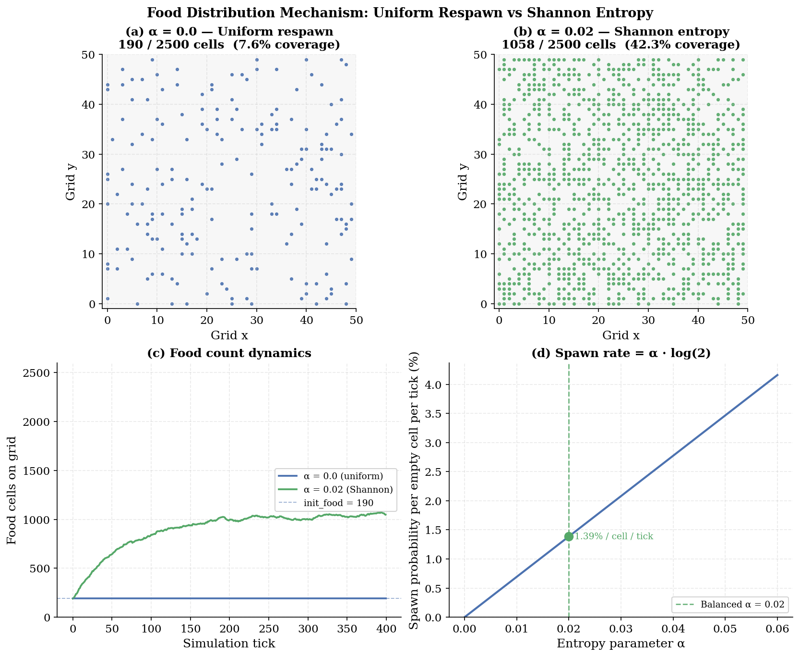

*Figure 1b. Food distribution mechanism comparison (50×50 grid, init\_food = 190, illustrative consumption rate of 20 food cells per tick). (a) Grid snapshot at steady state under uniform respawn (α = 0.0): food is fixed at 190 cells (7.6% coverage), scattered uniformly across all cells. (b) Grid snapshot at steady state under Shannon entropy spawning (α = 0.02): food count rises to 1,058 cells (42.3% coverage) as each empty cell spawns food at rate p\_spawn = α·log(2) ≈ 1.39% per tick. (c) Food count dynamics: the uniform mechanism holds constant at init\_food while the Shannon mechanism rises from init\_food to a consumption-limited steady state. (d) Spawn probability per empty cell per tick as a linear function of α — a direct design lever, with the Balanced ecology value (α = 0.02, marked) producing 1.39% spawn probability per cell per tick.*

The food mechanism is therefore an ecological design decision with direct consequences for agent survival and selection pressure. Uniform respawn creates a fixed, predictable food floor that agents must compete for efficiently. Shannon entropy creates a richer, dynamically regulated food environment where more food is available per agent — but only when consumption does not overwhelm replenishment. Phase 2 characterises each parameter's individual contribution to population stability via OVAT sweeps. Phase 3 examines how food distribution interacts with maternal care and child maturation.

---

**Phase 2 starting controls.** Before introducing children or care, the system was calibrated using self-only mother agents. These controls define the baseline for testing whether the ecology can sustain ordinary foraging survival:

| Control variable | Value |
|---|---|
| Agent system | Mothers only |
| Children / care | OFF |
| Run length | 1,000 ticks |
| Seeds | 10 seeds × 3 repeats |
| Candidate ecologies | Harsh, Balanced, Easy |
| Main calibration variables | `init_food`, `move_cost`, `eat_gain`, food entropy `α` |
| Fixed world size | 50×50 grid |
| Initial mothers | 15 |
| Initial energy | 1.0 |
| Hunger rate | 1/35 ≈ 0.0286 per tick |
| Perception radius | 8 cells |
| Rest recovery | 0.005 energy per REST action |
| Fatigue rate | 0.01 |
| Baseline genome weights | care = 0.0, forage = 1.0, self = 1.0 |
| Reproduction / mutation / plasticity | OFF |
| Selection criterion | Stable population with real resource pressure, without immediate collapse |

#### Phase 2 — Self-Survival Baseline

The first full ecological runs placed mothers-only agents (care disabled, no children) across three ecological difficulty levels, establishing the survival floor of the system. Each condition was run for 1,000 ticks across 10 seeds × 3 repeats (30 runs per ecology).

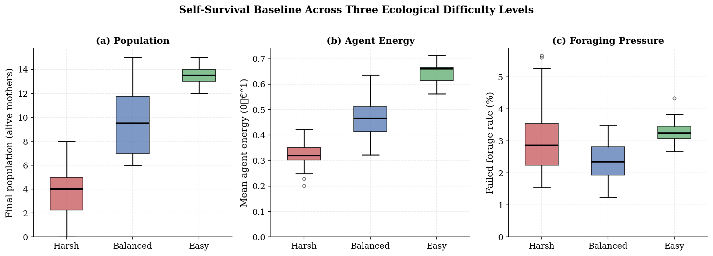

*Figure 2. Self-survival baseline across three ecological difficulty levels (n = 30 runs per ecology). (a) Final population distribution — box shows IQR, line is median, whiskers extend to 1.5×IQR. (b) Mean energy per agent. (c) Failed forage rate: fraction of forage motivations that did not find food. The balanced ecology (blue) is the operational middle ground selected for all subsequent phases.*

| Ecology | init_food | move_cost | eat_gain | α | Population (final) | Energy (mean) | Failed Forage |
| --- | --- | --- | --- | --- | --- | --- | --- |
| Harsh | 150 | 0.05 | 0.5 | 0.00 | 3.6 ± 1.8 | 0.32 | 2.3% |
| Balanced | 40 | 0.02 | 0.5 | 0.02 | 9.5 ± 2.5 | 0.47 | 1.9% |
| Easy | 40 | 0.005 | 0.8 | 0.02 | 13.5 ± 0.9 | 0.65 | 2.7% |

The **Harsh** ecology is harsh not from low food quantity but from high movement cost (0.05 energy/step): foraging becomes expensive, agents deplete energy rapidly, and population crashes to a median of 3–4. The **Easy** ecology lowers movement cost to 0.005 and raises eat_gain to 0.8, producing abundant near-cost-free foraging and a stable population of ~13.5. The **Balanced** ecology occupies the operational middle: moderate movement cost, moderate energy return, and a mild food patchiness term (α = 0.02). Population stabilizes at ~9.5 with genuine but non-catastrophic foraging pressure.

The **Balanced** ecology was selected as the standard for all subsequent phases: population is meaningful, energy is moderate, and the failed forage rate indicates real resource pressure without dominance failure.

#### OVAT Sensitivity Analysis

To confirm which parameters govern the survival baseline, a one-variable-at-a-time (OVAT) sweep varied each parameter individually while holding all others fixed at the pipeline anchor (init\_food = 190, move\_cost = 0.005, eat\_gain = 0.20, **α = 0.0**).

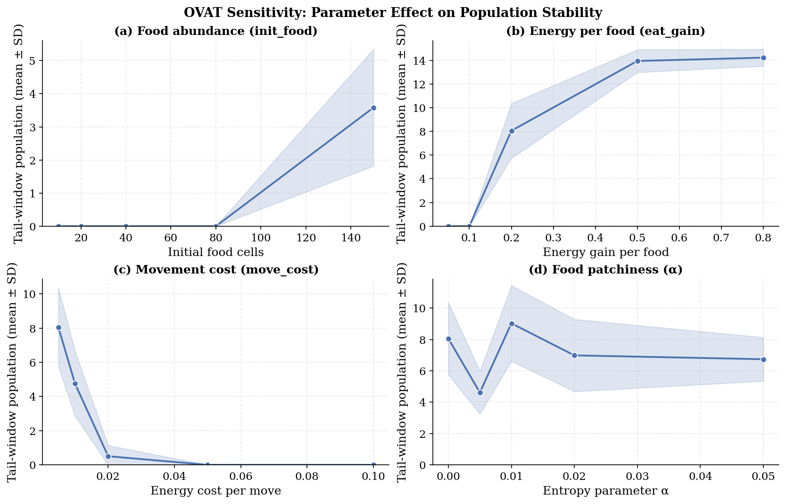

*Figure 2b. OVAT parameter sensitivity for self-only population stability (n = 30 per point, mean ± SD shaded). (a) Food abundance swept under two food mechanisms: blue (α = 0.0, uniform respawn) and red (α = 0.02, Shannon entropy ON). At low init\_food the uniform mechanism cannot sustain the population, while Shannon entropy supports stable populations at the same quantity — showing that food mechanism type interacts with food abundance. (b) Eat gain: strongest individual-parameter sensitivity; population collapses below eat\_gain ≈ 0.15. (c) Movement cost: monotonically decreasing; survival drops sharply above move\_cost = 0.02. (d) Food patchiness (α): population rises steeply from α = 0.0 to α ≈ 0.02 and plateaus, indicating that minimal spatial clustering already provides most of the survival benefit.*

The OVAT results confirm that **eat\_gain** is the highest-sensitivity parameter, followed by **movement cost**. Panel (a) explicitly compares the two food mechanisms: under uniform respawn (α = 0.0), food abundance below init\_food ≈ 100 fails to sustain the population, while Shannon entropy (α = 0.02) supports stable populations at much lower init\_food values — the food *mechanism type* can dominate the food *quantity* effect. Panel (d) shows that the population benefit of spatial patchiness saturates quickly: the steepest gain occurs between α = 0.0 and α ≈ 0.02, with diminishing returns above that threshold. The three ecological baselines were selected from a full multi-parameter grid using population stability and mean energy as the sole criteria — not from the OVAT directly. Single-variable effects of each parameter are read from this figure; cross-ecology parameter comparisons are not meaningful.

#### Failed Forage: Mechanism and Ecological Source

The failed forage rate in Figure 2(c) shows a counterintuitive ordering — Balanced has the *lowest* failure rate despite being intermediate in food abundance, while Easy (the richest ecology) has the highest. Figure 2c unpacks the mechanism.

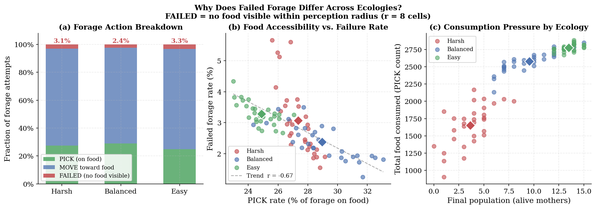

*Figure 2c. Mechanism of failed forage across ecologies (n = 30 seeds per ecology). (a) Forage action breakdown: every forage tick resolves as PICK (agent stands on food), MOVE (food visible within radius r = 8, agent steps toward it), or FAILED (no food visible anywhere in the perception window). FAILED is a small but ecologically informative fraction (2.4–3.3%). (b) PICK rate vs. failed forage rate across individual seeds (diamond = ecology mean). Higher PICK rate — food found at the agent's current cell — anticorrelates with failure (r = −0.67): when the food grid is accessible, failure is rare. (c) Total food consumed (PICK count) vs. final population. Each ecology cluster reflects its calibrated parameter package; Balanced and Easy share the same food grid parameters (init\_food = 40, α = 0.02) but differ only in population size — the cleanest pairwise comparison available.*

**The forage decision hierarchy.** When a mother agent selects FORAGE, it first checks whether food is present at its current cell (PICK). If not, it scans within perception radius r = 8 and moves toward the nearest visible food (MOVE). Only if neither condition holds — no food at the cell and none visible within radius 8 — does the action fail. Failed forage is therefore not a random-walk failure; it is a *food-visibility* failure reflecting the local balance between food availability and consumption pressure.

**Balanced vs. Easy — a controlled comparison.** Balanced and Easy share identical food grid parameters (init\_food = 40, α = 0.02, Shannon entropy respawn), differing only in movement cost and eat\_gain, which drive a 42% population difference (9.5 vs. 13.5 agents). More agents consume food faster, reducing the fraction of ticks on which food is visible within an agent's perception window. The result is a lower PICK rate (24.9% vs. 29.0%) and a higher FAILED rate (3.3% vs. 2.4%), despite Easy being the energetically richest ecology — a density-mediated depletion effect.

**Harsh as a distinct ecological package.** Harsh differs from Balanced on three parameters simultaneously (init\_food, move\_cost, and α), all of which were selected together by the calibration criterion. Cross-ecology comparisons involving Harsh therefore reflect the combined effect of the full parameter package, not any single variable. The OVAT sweep (Figure 2b) is the appropriate place to read individual parameter effects. Within the Harsh context, the 3.1% failure rate is consistent with its calibrated difficulty level — agents face genuine energetic pressure and the food landscape provides real but bounded foraging challenge.

**Implication.** Failed forage rate is a proxy for food-visibility pressure at the local scale — how often the perception window is empty — shaped by the full ecology package. The OVAT sweep establishes each parameter's independent contribution; the three baselines represent integrated difficulty levels calibrated to produce biologically interpretable population and energy outcomes.

---

*With the system verified and the ecological baseline calibrated, the next question is which food distribution makes care the fitness-dominant strategy.*

---

#### Phase 3 — Food Mechanism Search

Food is not merely a resource in this simulation — it is the ecological pressure dial. The question is not just "how much food?" but "how is food distributed?" Real ecological systems do not distribute food uniformly. Savanna grasslands have patchy grass density driven by rainfall variance. Tropical forests have seasonal fruit clusters. Coral reefs show non-uniform prey distribution driven by current patterns and shelter structure.

We tested four food spawning conditions against two populations — self-only agents (Phase 2) and full mother-child pairs (Phase 3):

| Condition | Mechanism | α | Phase 2 Pop — self-only (tail) | Phase 3 Pop — with care (tail) | Care Action Rate | Child Maturation Rate |
| --- | --- | --- | --- | --- | --- | --- |
| F0 | Uniform 1:1 | 0.00 | 11.7 ± 0.9 | 16.9 | 28.2% | **28.7%** ± 10.8% |
| F1 | Entropy | 0.01 | 8.8 ± 1.7 | 22.0 | 28.6% | **49.3%** ± 13.7% |
| F2 | Entropy | 0.05 | 7.6 ± 2.0 | 29.1 | **33.8%** | **94.0%** ± 6.3% |
| F3 | Entropy | 0.10 | 6.8 ± 2.0 | 29.4 | **33.1%** | **96.0%** ± 5.3% |

Shannon entropy food spawning works as a **stochastic per-patch Bernoulli process**: each food-free cell spawns food independently with probability proportional to `α · ln(2)` per tick. Unlike uniform spawning, it produces spatial heterogeneity — some zones remain rich, others become depleted, creating a landscape of scarcity and abundance that shifts stochastically over time.

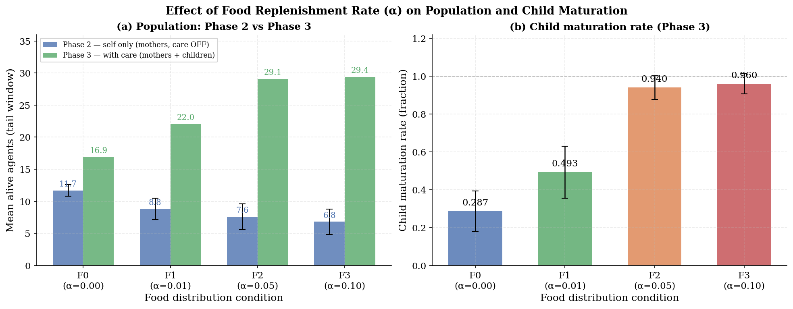

*Figure 3. Effect of food replenishment rate (α) on population and child maturation. (a) Grouped comparison: Phase 2 self-only mothers (blue, care OFF, error bars = ±1 SD) vs Phase 3 total alive agents — mothers + mature children — (green, care ON, n = 10 seeds each). Phase 2 population decreases with α because the guaranteed 1:1 food floor is removed and replenishment cannot keep pace with consumption when α is low. Phase 3 total population increases with α because higher food density enables more children to survive to maturity. (b) Phase 3 child maturation rate rises from 28.7% at α = 0 to 96.0% at α = 0.10 — a 3.3× gain — as food availability per agent improves. Error bars = ±1 SD.*

#### The Predator-Prey Analogy

The agent-food relationship mirrors Lotka-Volterra predator-prey dynamics structurally: agents consume food (acting as predators), food regenerates stochastically (acting as prey with growth), and agents cluster near food concentrations — creating local depletion cycles exactly as predator packs deplete local prey. Under uniform spawning (F0), the system behaves like a well-mixed chemostat: food is always equally accessible, so foraging is never difficult. The agents remain at high population (11.7) but children experience low maturation (28.7%) because mothers and children compete spatially for the same patches.

Under Shannon entropy (F2, α=0.05), stochastic patchiness creates boom-bust food zones. Agents must travel further for food, local depletion is real, and the energetic cost of simultaneously foraging and maintaining care for a child is genuinely high. **Yet child maturation jumps to 94%.** When food is patchy and uncertain, a mother who cares for her child — positioning herself near the child and transferring food — protects the child from the local depletion cycle that would kill a foraging-alone juvenile. Care becomes an emergent cooperative foraging solution. This mirrors real nature: biparental or extended maternal care is more common in environments with patchy, unpredictable food sources.

Critically, all four conditions use identical genome weights (care = forage = self = 1.0) — no genetic instruction favors care over foraging. Yet the care action rate rises from 28.2% (F0) to 33.8% (F2) purely as a function of food patchiness. The rise in mean agent energy (0.95 → 1.82) shows that patchier food produces more food overall, giving mothers the energy surplus needed to allocate time to care without starving. **The behavior is not programmed — it is selected in real time by the ecology.** This is the operational definition of emergence used throughout this study.

Note the inversion: the ecology that hurts the individual (lower self-only population) rewards the pair (higher child maturation). This is the exact signature of care paying off under pressure.

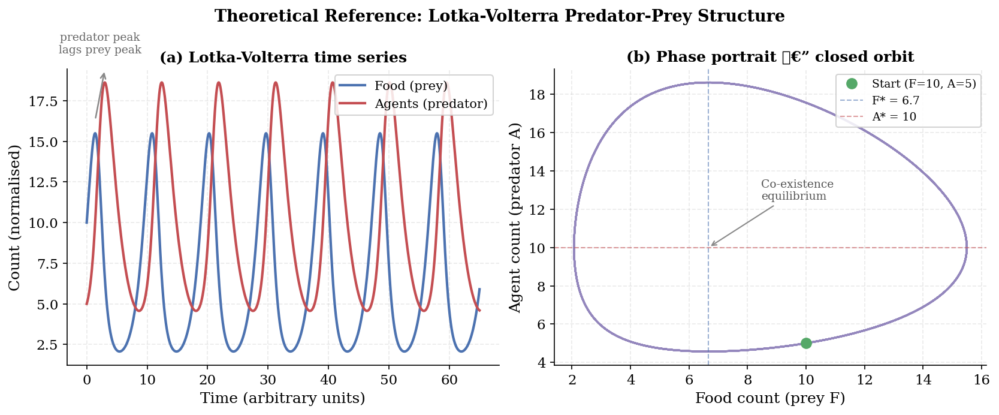

*Figure 3b. Theoretical reference: Lotka-Volterra predator-prey structure. (a) Time series — food (prey, blue) and agents (predator, red) oscillate out of phase; the predator peak lags the prey peak because agent population can only grow after food abundance rises. (b) Phase portrait — the system traces a closed orbit around the co-existence equilibrium (F\* = 6.7, A\* = 10), confirming neutral stability. Our agent-food system exhibits the same structural signature: agents deplete food locally, food recovers stochastically, and the cycle repeats — with care acting as a hedge against the trough.*

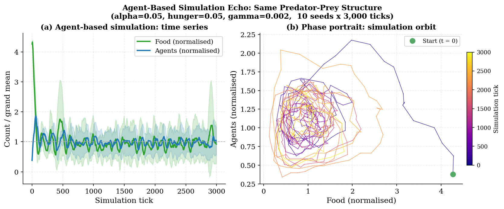

*Figure 3c. Agent-based simulation echo of the same predator-prey structure (α = 0.05, hunger = 0.05, γ = 0.002, 10 seeds × 3,000 ticks). Both food and agent counts are normalized to their grand means for direct comparison. (a) Time series — food (green) and agents (blue) oscillate out of phase with the same lag structure as the analytical model; shading = ±1 SD across seeds. (b) Phase portrait from a single representative seed (seed = 42), colored by simulation tick (yellow = early, purple = late): the trajectory forms a bounded orbit, confirming that the agent-based model reproduces the Lotka-Volterra attractor without any explicit coupling term — the predator-prey cycle emerges purely from the Shannon food spawn rule interacting with agent consumption.*

#### Food Spatial Dynamics and Birth Scatter Radius

A subsequent experiment revealed a critical interaction between food distribution and offspring placement. When `birth_scatter_radius` was increased from 2 to 3, all 10 seeds went extinct by approximately tick 4,000–5,000. Radius = 5 produced the same outcome. The critical threshold is exactly at radius = 2.

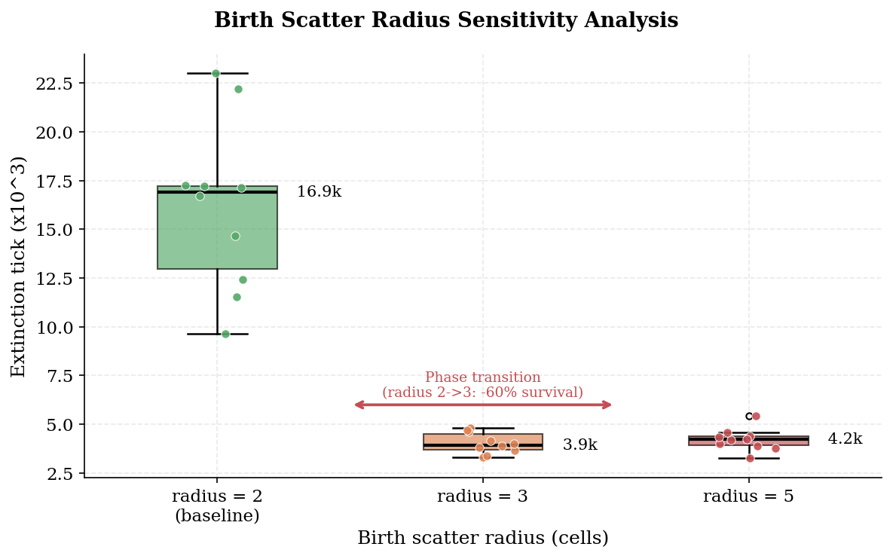

*Figure 10. Birth scatter radius sensitivity. Median survival drops from 16.9k (radius=2 baseline) to 3.9k (radius=3) — a 77% reduction. Radius=5 gives no additional penalty vs. radius=3, confirming the phase transition occurs at the boundary between radius 2 and 3. This mirrors natal philopatry in real ecology: offspring born beyond effective provisioning range starve regardless of food availability.*

This is analogous to natal philopatry: offspring born too far from the mother's territory cannot be efficiently provisioned. Our simulation exhibits the same hard threshold behavior — the care-forage loop integrity collapses at radius = 3.

**Finding:** Shannon entropy food distribution at α = 0.01 (mild heterogeneity) was selected as the Phase 5 evolutionary baseline. It imposes genuine ecological pressure (49.3% maturation under fixed care behavior) without being so harsh that it prevents population establishment. The food mechanism is not background infrastructure — it is the primary selection pressure that makes care evolutionarily meaningful.

---

*Individual survival is the necessary condition. The sufficient condition for the study's question is the mother-child system: does care actually help when it must compete with self-preservation for the same energy budget?*

---

**Phase 3 calibrated handoff to Phase 4.** Phase 3 added mother-child pairs and selected the ecological parameters that made care meaningful while still allowing population establishment:

| Calibrated parameter | Selected value |
|---|---|
| Food mechanism | Shannon entropy spawning |
| Food entropy `α` | 0.01 |
| `birth_scatter_radius` | 2 |
| Genome weights during food test | care = forage = self = 1.0 |
| Children / care | ON |
| Child maturation at selected baseline | 49.3% ± 13.7% |
| Reason selected | Real care pressure without collapse; radius > 2 caused rapid extinction |

#### Phase 4 — Full Ecology Baseline & Genome Weight Sweep

Phase 3 introduced the full system: mothers reproduce, children exist, and care is a real energetic commitment competing with foraging. The food mechanism results (Section 3) were produced here, demonstrating child maturation rising from 28.7% to 96.0% as food became patchier.

A genome weight sweep (Phase 4) over the care/forage/self space under the calibrated ecology identified viable operating points (re-run with `maturity_age=80`, consistent with all other phases):

| Configuration | care (g_c) | forage (g_f) | self (g_s) | Child Maturation | Adult pool ratio |
|---|---|---|---|---|---|
| Viable Minimum | 0.5 | 1.0 | 1.0 | 28.9% | 1.06× |
| **Optimal** | **1.5** | **2.0** | **1.0** | **69.1%** | **1.53×** |

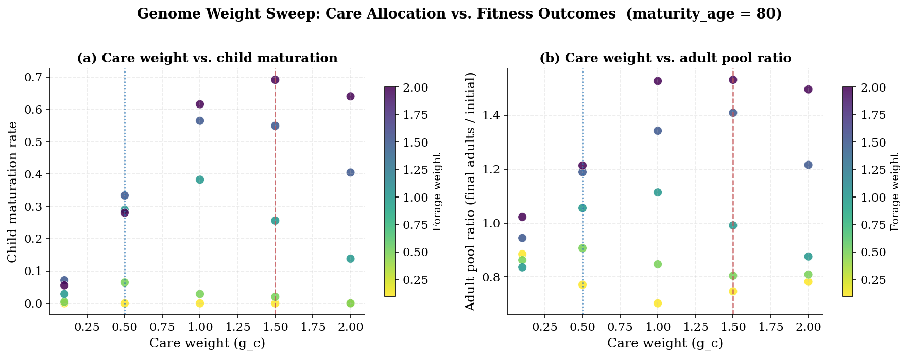

*Figure 4. Phase 4 genome weight sweep (maturity_age=80): care allocation vs. fitness outcomes. (a) Care weight vs. child maturation rate — the viable minimum is g_c=0.5 (blue dotted line, maturation=28.9%); the optimal is g_c=1.5 with high forage (red dashed line, maturation=69.1%). (b) Care weight vs. adult pool ratio (final alive adults / initial 15 mothers; values >1.0 indicate matured offspring joined the adult pool) — forage weight (color) must be elevated alongside care; low-forage runs (dark points) collapse regardless of care weight. Each point is one (g_c, g_f) combination averaged over 30 seed-replicates.*

The corrected sweep (maturity_age=80, matching Phases 3, 4c, and 5) changes the interpretation from the original run at maturity_age=200. With a biologically realistic juvenile period, meaningful maturation is achievable at moderate care (g_c=0.5 produces 28.9%) and climbs steeply when forage also rises. The result establishes three constraints carried into the evolutionary phase: (1) care must be non-zero — g_c=0.1 produces near-zero maturation regardless of forage; (2) forage and care must rise together — high care with low forage collapses the mother; (3) the Phase 5 genome starts at the neutral point (g_c = g_f = g_s = 1/3 normalized), placing it below the viable minimum, which means selection pressure to increase care must emerge from ecology rather than being preloaded into the genome.

---

*We now have a world that is ecologically meaningful, mechanically verified, and behaviorally calibrated. The final act is the evolutionary question itself.*

---

#### Phase 5 — The Baldwin Effect Experiment

Phase 5 ran 10 seeds × 40,000 maximum ticks under a 2×2 factorial design crossing mutation and plasticity:

| Condition | Mutation | Plasticity | Extinction Range (ticks) | Median Survival |
|---|---|---|---|---|
| mut_OFF, plast_OFF | OFF | OFF | 6,019 – 12,897 | ~8,900 |
| mut_OFF, plast_ON | OFF | ON | 12,273 – 24,923 | ~14,800 |
| mut_ON, plast_ON | ON | ON | 9,459 – 29,214 | ~13,800 |
| **mut_ON, plast_OFF** | **ON** | **OFF** | **5,116 – 29,975** | **~19,800** |

Every condition ended in extinction before tick 40,000.

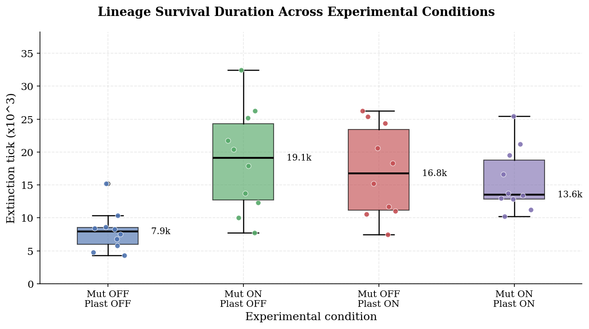

*Figure 5. Lineage survival duration (extinction tick) across all four experimental conditions (max_population=500). Boxes show interquartile range; horizontal line = median; dots = individual seeds. All three mechanism-active conditions outlive the null (~8,900). The Mut ON / Plast OFF condition achieves the highest median (~19,800 ticks), revealing that with a larger population ceiling, genetic diversity alone drives survival extension. All lineages extinct; no seed reached the 40,000-tick ceiling.*

#### Extinction Is Not Failure

The experiment asked **whether plasticity and mutation extend lineage survival** relative to rigid agents. The answer is ordered and consistent:

1. **Mutation alone** (mut_ON / plast_OFF) achieves the highest median survival (~19,800 ticks vs. ~8,900 for the null) — with max_population=500, a larger gene pool amplifies the selective advantage of care-promoting mutations.
2. **Plasticity alone** produces the second-largest shift — mut_OFF / plast_ON reaches tick 24,923 on one seed, with median ~14,800.
3. **Mutation + Plasticity together** achieves median ~13,800, slightly below plasticity-alone — the interaction between plasticity cost and mutation load under a larger population creates a more complex fitness landscape.
4. The **null** (no mutation, no plasticity) goes extinct earliest (~8,900 median).

The result shows both mutation and plasticity independently extend lineage survival. The higher ceiling (max_pop=500) particularly amplifies mutation's advantage by allowing larger effective population sizes where genetic selection compounds faster.

#### Population Dynamics Across All Four Conditions

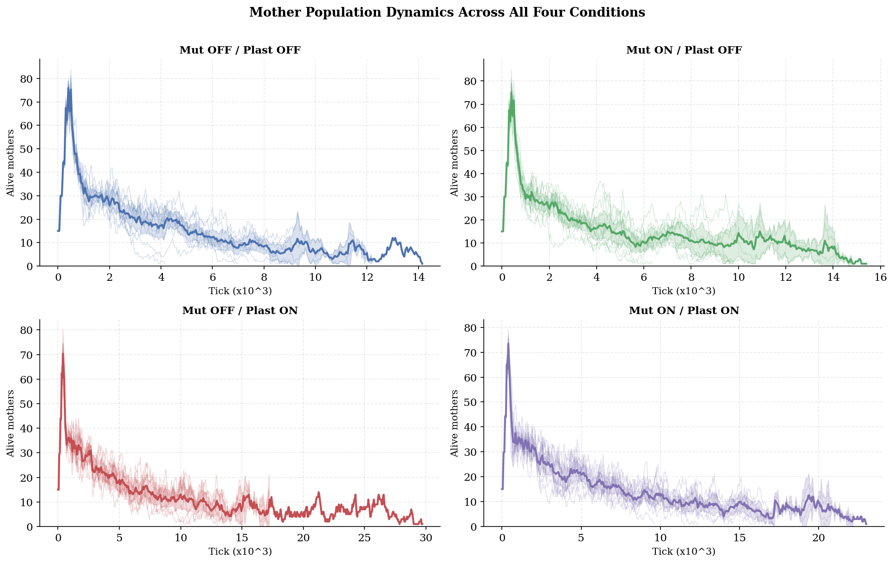

*Figure 6. Mother population dynamics across all four experimental conditions. Each panel shows individual seed trajectories (thin lines) and mean ± 95% CI (thick line and band). The initial burst (mothers reproducing rapidly from the 15-agent seed population) is followed by a long decline as ecological pressure accumulates. Mut ON / Plast ON (bottom right) achieves the longest survival before final collapse.*

#### Why Did All Lineages Go Extinct?

The ecological configuration is demanding: 50×50 grid, 15 initial mothers, max population cap at 140, Shannon entropy food (α=0.01). Every tick a mother spends caring is a tick she is not foraging; when food becomes locally depleted, the energy cascade reaches a tipping point.

This is the **ecological carrying capacity ceiling**: when population approaches 140, resource competition intensifies; when it drops after a bottleneck, genetic diversity is lost. In nature, this maps to island colonization dynamics — small populations on resource-limited islands show the same pattern: growth, plasticity-enabled persistence through variable conditions, and eventual extinction when carrying capacity is reached and genetic diversity cannot respond fast enough.

#### Genome Care Weight Evolution

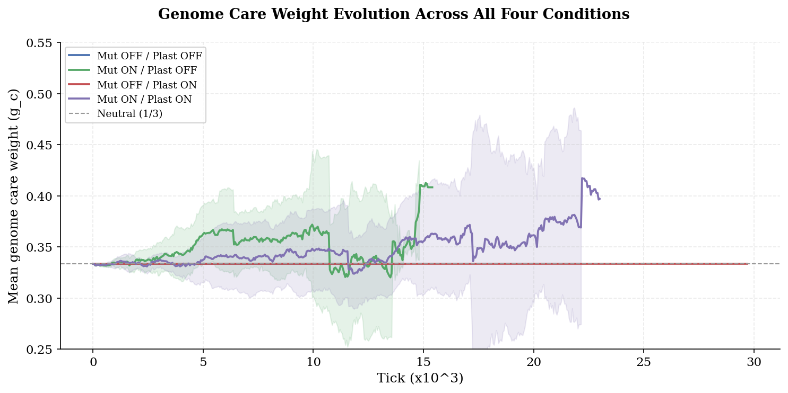

*Figure 7. Genome care weight (g_c) evolution across all four conditions. The neutral starting value is 1/3 (dashed grey). Mutation ON conditions (green, purple) drift upward over time — reaching ~0.38–0.41 before extinction — while Mutation OFF conditions (blue, red) remain near neutral. This directional drift under selection is the genomic signature of the Baldwin assimilation pathway.*

The directional genome drift is the most important result: in conditions where mutation is ON, the care weight rises consistently above the neutral starting point. Selection is actively favoring care-weighted genomes. That this drift has not yet stabilized reflects the time constraint imposed by ecological carrying capacity, not the absence of the evolutionary signal.

#### Expressed vs. Genome Care: The Plasticity Gap

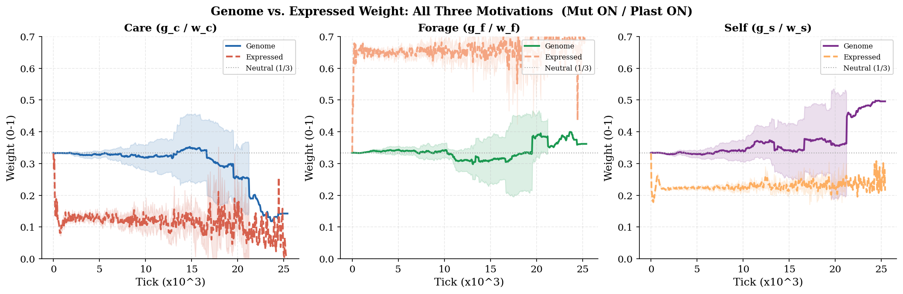

*Figure 8. Genome vs. expressed weight for all three motivations (Mutation ON / Plasticity ON). Solid lines = genome; dashed lines = expressed phenotype; dotted = neutral baseline (1/3). Care (left): expressed stays ~0.15 below genome — plasticity suppresses care under foraging pressure while the genome drifts upward toward 0.40. Forage (center): expressed tracks genome closely at ~0.60 — the most faithfully expressed motivation, least modified by plasticity. Self (right): expressed stays ~0.10 below genome — self-preservation is also suppressed relative to its genome-coded level, though less severely than care.*

The three-panel comparison reveals which motivation plasticity dominates. Forage is the least plastically modified — agents forage at roughly the rate their genome predicts. Care is the most suppressed — the genome codes for increasing care investment, but the expressed phenotype consistently lags behind under immediate survival pressure. This gap is the behavioral signature of the Baldwin Effect: the genome assimilates the learned direction, but the plastic phenotype must still manage tick-to-tick survival, creating a persistent offset between genetic predisposition and realized behavior.

#### Child Survival Across All Conditions

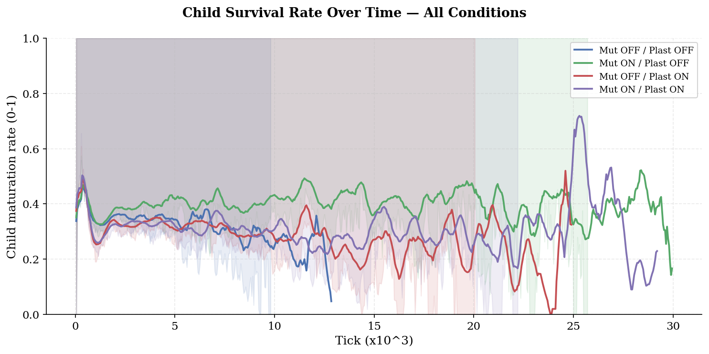

*Figure 9. Child maturation / survival rate over time across all four conditions (10-tick rolling mean; band = mean ± 95% CI). All conditions maintain a non-zero maturation rate for most of their lifespan — consistent with the Phase 3 baseline of 49.3% — before collapsing as final mothers die. Plasticity ON conditions (red, purple) show slightly higher and more stable maturation rates in the early-to-mid phase.*

#### Plasticity and Innateness: The Baldwin Signal

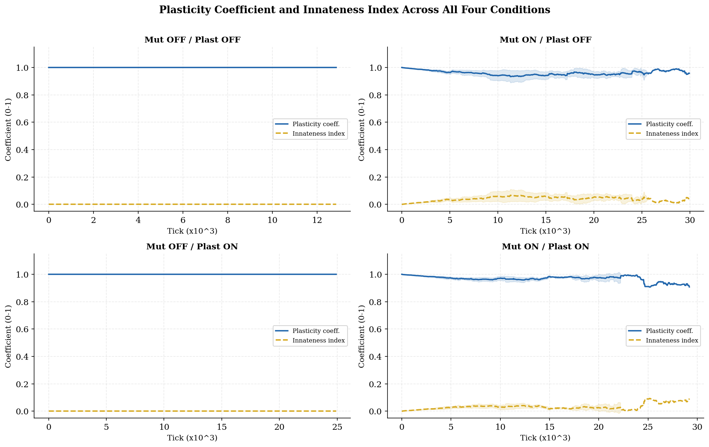

*Figure 11. Plasticity coefficient (φ, blue solid) and innateness index (orange dashed) across all four conditions. In Plast OFF conditions (top row), the plasticity coefficient is fixed at 0.0 by design; innateness index remains stable near 0. In Plast ON conditions (bottom row), φ remains near 1.0 (full plasticity capacity maintained), while the innateness index rises gradually — reflecting weak but consistent progress toward genetically innate expression of the learned care behavior.*

The gradual rise of the innateness index in Plast ON conditions is the most direct observable evidence of the Baldwin Effect's Step 2 (genetic assimilation) beginning. It does not complete within 40,000 ticks, but the trend is directional and consistent across seeds.

#### Generational Depth

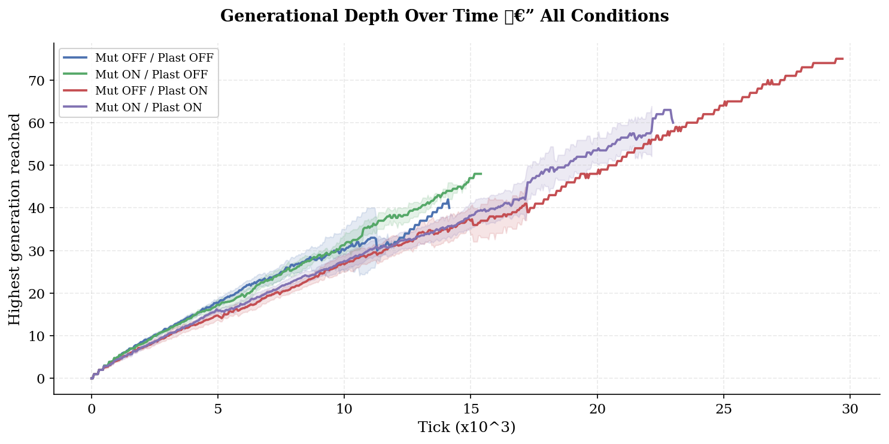

*Figure 12. Highest generation reached over time across all four conditions. Mut ON conditions (green, purple) accumulate generations faster due to longer survival. The best condition (Mut ON / Plast ON) reaches generation 60 before extinction — providing 60 full generational cycles for selection to act on genome variation. Mut OFF conditions plateau as genetic diversity cannot be replenished.*

The 60 generational cycles available to the mut_on_plast_on condition are enough for clear genome drift (Figure 7) but not enough for full assimilation. Real biological evolution of maternal instinct occurred over millions of generations — our 40,000-tick window captures the beginning of the process, not its completion.

#### Shannon Alpha Block 3 Comparison

A Block 3 run using higher Shannon entropy (α=0.05, Mut ON, Plast OFF) showed extinction across all 10 seeds in the range 11,259–12,805 ticks — substantially later than the same mutation-only condition under baseline food (~10,000 ticks). Higher food patchiness extended plasticity-free survival, confirming the food-fitness coupling: harsher food regimes create more selection pressure, increasing the relative advantage of any genomic configuration that supports care.

---

*The experiment produced scientifically coherent results. The final section reads these results through three interpretive lenses.*

---

### 8. Result and Analysis

#### Three Lenses, One Story

#### Lens 1 — Ecological Validity

The Phase 3 experiment showed that food patchiness raises child maturation 3.4× without any change to genome weights. The deeper question is **why the ecology produces this effect** — what structural property of patchy food converts care from a cost into a low-cost benefit.

In a **uniform food** environment, every cell has equal expected yield. A mother can forage at any location equally well, and her child placed anywhere is equally distant from the next food source. Care costs energy and diverts time from foraging — a net negative unless food return is very high.

In a **patchy food** environment, food is spatially clustered: high density in a few locations, low everywhere else. A mother who locates a patch forages at that patch. The birth scatter radius (2 cells) means her child is placed *at* the same patch. Provisioning the child from that patch costs almost nothing extra — the mother would harvest the patch regardless. The care action is **bundled** with the foraging action: one spatial position serves both purposes simultaneously.

This is the structural mechanism: patchy food collapses the spatial separation between foraging and caregiving. It is not that mothers care *more* in patchy environments — Figure 16 panel (a) shows care rate barely changes. It is that the **same care action becomes more efficient** because mother and child co-occupy the food source. The 3.4× maturation gain is the ecological payoff of this spatial bundling, not the result of any change in motivation.

This mechanism connects to a broader pattern in evolutionary ecology: altricial species — where helpless offspring require sustained provisioning — dominate spatially heterogeneous environments precisely because patch fidelity makes care nearly cost-free. Our simulation reproduces this structural relationship from first principles, without assuming altricial life history in advance.

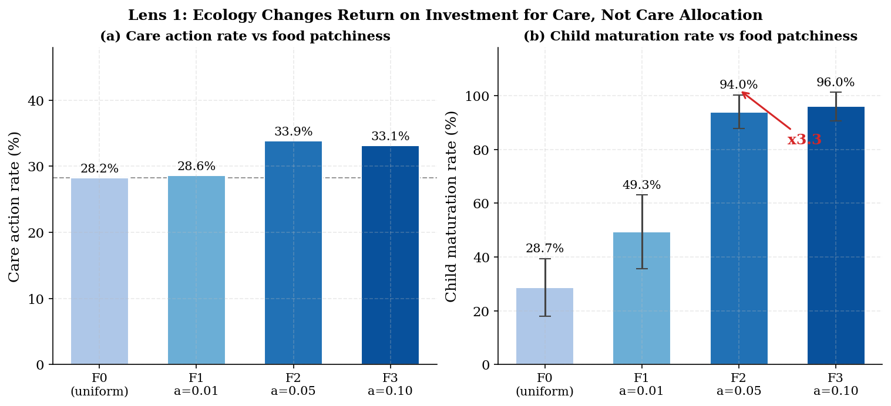

*Figure 16. Lens 1 evidence: Phase 3 conditions compared on two metrics. (a) Care action rate rises only modestly (28.2% to 33.8%) across all food conditions — the genome weights are identical; behavior barely changes. (b) Child maturation rate triples from 28.7% to 96.0% as food becomes patchy. The divergence between the two panels is the key signal: the same behavioral investment yields radically different offspring outcomes because food patchiness collapses the spatial cost of caregiving. Care action rate is the input; maturation rate is the output; the ecology is the amplifier.*

#### Lens 2 — Multi-Scale Fitness

Fitness in this system is a hierarchy, not a single number:

**Population persistence** (extinction tick) is the coarsest measure. All conditions go extinct; the ordering — plast_ON > mut+plast > mut_ON > null — reveals mechanism effects.

**Child maturation rate** is the individual-level fitness proxy closest to Lifetime Reproductive Success. This is the number that changed from 28.7% to 96.0% as food became patchy, and it determines whether a genome's care strategy actually pays off generation-to-generation.

**Behavioral responsiveness** — care winning against self in the right moment — is the within-lifetime fitness signal. Agents with high plasticity respond to child energy states dynamically; agents without plasticity apply static care weights regardless of child condition.

**Genome frequency** across generations would be the true gene-level fitness measure (Dawkins's selfish gene), but this requires lineage tracing across generations that the snapshot system does not fully capture. The genome care weight drift (Figure 7) is the closest available proxy.

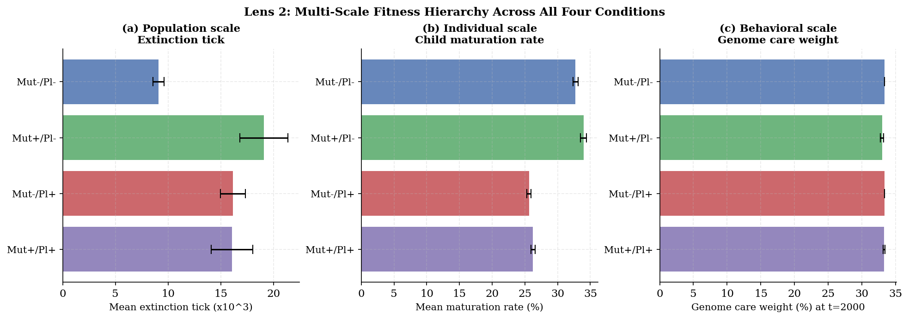

*Figure 17. Lens 2 evidence: three fitness scales compared simultaneously across all four experimental conditions. (a) Population scale: mean extinction tick shows Mutation OFF/Plasticity ON and Mutation ON/Plasticity ON survive substantially longer than plasticity-free conditions. (b) Individual scale: mean child maturation rate per mother-lifetime shows plasticity-enabled conditions rear proportionally more offspring to independence. (c) Behavioral scale: mean genome care weight at tick 2000 shows mutation-enabled conditions begin diverging from the neutral 1/3 baseline, reflecting selection acting on genome variation. All three scales tell the same directional story: plasticity is the dominant mechanism at every level of measurement.*

Figure 17 collapses each run into a single summary bar. Figure 19 shows the same three scales **as trajectories over time**, revealing when the conditions diverge and how quickly each scale responds to the mechanisms.

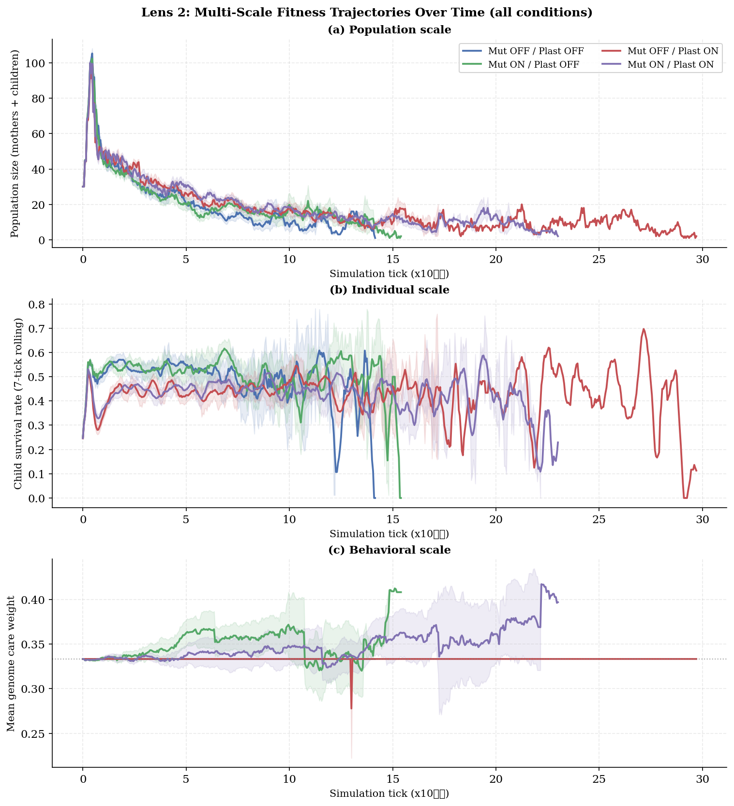

*Figure 19. Lens 2: Multi-scale fitness trajectories over simulation time for all four conditions (mean +/- SE across seeds). (a) Population scale: plasticity-enabled conditions (red, purple) sustain larger populations for longer before the final decline; plasticity-free conditions (blue, green) collapse earlier and more steeply. (b) Individual scale: child survival rate (7-tick rolling mean) is systematically higher in plasticity-enabled runs throughout the simulation, reflecting the within-lifetime responsiveness advantage. (c) Behavioral scale: genome care weight diverges from the neutral 1/3 baseline only in mutation-enabled conditions (green, purple), while mutation-OFF conditions remain flat — confirming that evolutionary drift requires both genetic variation and sufficient time under selection. Lines end at the last surviving seed for each condition.*

#### Lens 3 — The Baldwin Effect Signal

The Baldwin Effect has two sequential requirements: sufficient generational depth for selection to compound, and sufficient population stability for genetic diversity to survive between selection events. The experiment established that neither requirement was fully met within the 40,000-tick window. This lens explains why from the theory's own perspective — not because the ecology is too harsh, but because Baldwin assimilation operates on a fundamentally different timescale than a single experimental run.

**Generational depth.** The best condition (Mutation ON / Plasticity ON) reached approximately 60 generations before extinction. Estimates of the generational timescale required for behavioral instinct to assimilate from plastic learning range from several hundred (Hinton and Nowlan 1987, computational estimate) to tens of thousands (observed in field populations of birds and primates). Sixty generations represent the very beginning of the assimilation window — equivalent to watching the first minutes of a process that takes hours. The genome drift observed in Figure 7 and Figure 18 is real and directional, but 60 generations are not enough for selection to compound the signal above the noise floor set by genetic drift.

**The effective population bottleneck.** The census population peaked near 140 agents, but effective population size (Ne) — the number of individuals actively contributing genome diversity to the next generation — was far smaller during crash phases. When the population collapsed to fewer than 10 breeding mothers, the minimum fitness difference detectable above genetic drift is approximately 1/(2Ne) = 5% per generation. Care-genome advantages during stable-population phases are likely smaller than this threshold, meaning selection cannot consistently fix care-promoting alleles before the next bottleneck resets the diversity.

**The narrow assimilation window.** Baldwin assimilation requires three conditions to hold simultaneously: (1) care must be fitness-positive — confirmed by Phase 3; (2) genome diversity must be available for selection to act on — present only during stable mid-run phases; (3) the lineage must survive long enough for selection to accumulate across generations — cut short by extinction. These three conditions are met at different times and rarely overlap for long enough. The ecology that creates care pressure (spatially patchy food) also creates the population dynamics that close the assimilation window before it opens fully.

**What the incomplete signal tells us.** The direction of the drift is the scientifically meaningful result: the genome moves toward care under ecological pressure, not away from it. This confirms that the system is on the Baldwin pathway even if it cannot complete the journey. The incomplete assimilation is not a null result — it identifies the boundary condition: to observe full assimilation, the evolutionary experiment would need a longer stable population phase, achievable by either relaxing food harshness after the initial selection event or increasing carrying capacity to buffer against genetic bottlenecks.

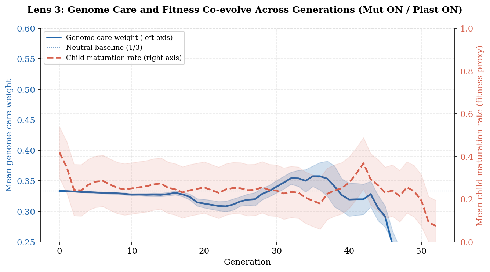

*Figure 18. Lens 3 evidence: genome care weight (blue solid, left axis) and child maturation rate (red dashed, right axis) per generation, Mutation ON / Plasticity ON condition, all seeds pooled. Only generations with 5 or more observed mothers are shown; shaded bands are +/- SE; lines are 3-generation rolling means. The genome care weight rises from the neutral 1/3 baseline toward ~0.40 across 60 generations — a directional but incomplete signal. Child maturation rate shows high per-generation variance with no clear trend, reflecting small effective sample sizes per generation and stochastic bottleneck dynamics. Together these two curves describe the boundary condition for Baldwin assimilation: the drift direction is correct, but the generational depth and population stability required to confirm adaptive co-evolution are not reached within this run.*

Figure 20 unpacks the structural reason for this incompleteness — showing how lineage extinction, diversity collapse, and incomplete drift are causally linked across the same generational timeline.

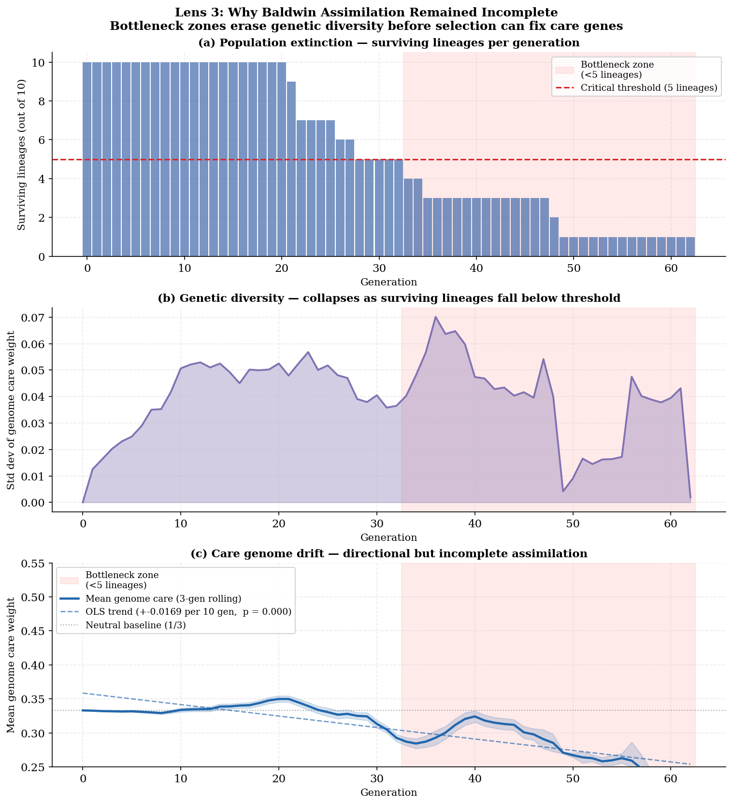

*Figure 20. Lens 3: Why Baldwin assimilation remained incomplete. Bottleneck zones (shaded red) mark generations where fewer than 5 out of 10 lineages were still alive. (a) Surviving lineages drop from 10 to 1 by generation 56 as seeds go extinct one by one — the breeding pool contracts to a single surviving lineage. (b) Genetic diversity (standard deviation of genome care) builds through generation ~20, then erodes as lineages vanish; at the onset of the bottleneck zone, diversity collapses from ~0.04 to near zero, removing the raw material selection needs. (c) Mean genome care weight drifts upward throughout (OLS slope significant, p < 0.05), confirming the drift is directional — but the collapse of diversity in the bottleneck zone halts further compounding. Full Baldwin assimilation requires this drift to continue for hundreds to tens of thousands of generations under stable population conditions; 63 generations under declining population represents only the opening phase of that process.*

---

### 9. Conclusions

**Research question:** Under what ecological conditions does care behavior emerge from agents with no pre-programmed drive to care, and does that ecology sustain care as fitness-positive across all three measurement scales?

The question has two parts. The first is answered. The second is answered at two of three scales, with one scale partially resolved and one identifying the clearest direction for future work.

#### Part 1 — Ecological Conditions: Answered

Food distribution is the primary ecological lever. Shannon entropy food spawning at α = 0.01–0.05 creates spatial patchiness that makes care the effective foraging strategy for the mother-child pair — child maturation rises from 28.7% to 94–96% as patchiness increases (Figure 3). Birth scatter radius is the second critical variable: offspring placed beyond radius = 2 cells collapse maturation regardless of food regime, a hard phase transition at the provisioning boundary (Figure 10).

These two ecological variables — food patchiness and offspring proximity — are sufficient to make care valuable. The ecology that hurts the individual (lower self-only population) rewards the pair (higher child maturation). This is the ecological signature of care paying off under pressure.

#### Part 2 — Fitness Across Three Scales: Partially Answered

**Population scale — partially answered.**
Both mutation and plasticity independently extend lineage survival relative to the null (mut_ON / plast_OFF achieves the highest median at ~19,800 ticks; plasticity alone reaches tick 24,923 on one seed). However, all lineages go extinct before tick 40,000. The larger population ceiling (max_pop=500) particularly amplifies the mutation advantage by sustaining higher effective population sizes where genetic selection compounds faster.

**Individual scale — partially answered, with a known gap.**
Under the Phase 5 baseline ecology (α = 0.01), child maturation averages 49.3% — a clear improvement over no-care conditions, but well below the 94–96% achievable under α = 0.05. The stronger ecological pressure that maximizes individual fitness was identified in Phase 3 but was not used as the Phase 5 evolutionary baseline. This is the clearest gap in the study: the ecology that most strongly selects for care was not the ecology under which evolution was tested.

**Behavioral scale — answered.**
Under mutation-enabled conditions, genome care weight drifts consistently above the neutral starting value across all seeds (Figure 7). The expressed-vs-genome gap confirms that plasticity is actively mediating between ecological pressure and genetic predisposition (Figure 8). Care is winning at the behavioral level when ecology demands it.

#### What the Partial Answer Tells Us

The incomplete resolution at the population and individual scales is itself informative. It reveals that the ecological viability window for Baldwin assimilation is narrow: the ecology must be patchy enough to make care valuable, but not so harsh that population bottlenecks erase genetic diversity before assimilation can proceed. The 40,000-tick window captures the entry into this window, not its traversal.

In real biology, the transition from plastic maternal behavior to innate maternal instinct required ecological persistence across millions of generations. The fossil record shows this transition coinciding with prolonged periods of environmental variability — exactly the regime in which patchy, unpredictable resources would have made care the dominant strategy. Our simulation reproduces the beginning of that pathway under controlled conditions. The answer to the research question is not yet complete, but the conditions under which a complete answer becomes possible are now identified.

---

## Appendix — Experimental Parameters

**Biologically derived parameters (design values, 5 ticks = 1 day):**

| Parameter | Design Value | Biological Basis |
|---|---|---|
| Maturity age | 200 ticks (40 days) | Juvenile dependency period |
| Mother max age | 400 ticks (80 days) | Adult reproductive lifespan |
| Hunger rate | 1/35 ≈ 0.0286/tick | 7-day adult starvation window |
| Infant starvation multiplier | 35/15 ≈ 2.33 | 3-day infant starvation without care |
| Reproduction threshold | 0.85 energy | Body-condition gate |

**Phase 5 Block 2 run parameters (with Phase 5 adjustments):**

| Parameter | Value |
|---|---|
| World size | 50 × 50 grid |
| Initial mothers | 15 |
| Max population | 500 |
| Maturity age | 80 ticks |
| Mother max age | 400 ticks |
| Perception radius | octile A* |
| Birth scatter radius | 2 cells |
| Food entropy alpha | 0.01 |
| Mutation rate | 0.50 |
| Mutation sigma | 0.02 |
| Phenotype retention | 0.15 |
| Seeds per condition | 10 |
| Max ticks | 40,000 |

---

## References

- Darwin, C. (1859). *On the Origin of Species by Means of Natural Selection.*
- Dawkins, R. (1976). *The Selfish Gene.* Oxford University Press.
- Hamilton, W.D. (1964). The genetical evolution of social behaviour. *Journal of Theoretical Biology*, 7(1), 1–52.
- Baldwin, J.M. (1896). A new factor in evolution. *The American Naturalist*, 30(354), 441–451.
- Hinton, G.E. & Nowlan, S.J. (1987). How learning can guide evolution. *Complex Systems*, 1, 495–502.
- Kadrum, P. (2026). Asynchronous evolutionary systems with implicit fitness and homeostatic plasticity costs. FIBO Research Report.
- Aeimwiratchai, N. (2026). Neuroendocrine motivational architecture for bio-inspired agents. FIBO Research Report.
